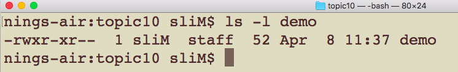

# CSCI 185 Spring 2022
# Homework 10
# Due: 23:59pm 05/09/2021

# Step 1: Use the following figure to solve Q1, Q2, and Q3

# Q1: Describe the permissions that are granted on three different levels of access.
+ What permission(s) does the owner of the file have?
+ What permission(s) does the group that the file belongs to have?
+ What permission(s) does everyone else other than the owner and the members of a group have?

# Q2: Write two chmod commands to add the permission of write to the group that the file belongs to (one command will not affect the other).
+ use chomod with letters in one command
+ use chomod with numbers in the other.

# Q3: The followings two command will result in the same permissions that are granted on three levels of access (one command will not affect the other).
+ A. True
+ B. False

~~~~
chmod a-w demo
~~~~

~~~~
chmod 554 demo
~~~~
# Step 2: Suppose the following two bash scripts have been made executable by the chmod command, please revise the ∼/.bash\_profile (mac) or ∼/.profile (linux) and run the source command so that we can use helloworld and addseq as commands on the command line.
+ You need to take the screenshots of
  - how you revise the **∼/.bash\_profile (mac)** or **∼/.profile (linux)** file
  - how you run the **source** command on the command line
  - how you use **helloworld** and **addseq** as commands on the command line/terminal
+ Note: The code you provide in **∼/.bash\_profile (mac)** or **∼/.profile (linux)** depends on where the scripts are located.

~~~~
#!/bin/bash
#filename: helloworld

echo "Hello world"
~~~~

~~~~
#!/bin/bash
#filename: addseq.sh

function addseq {
         local sum=0
         for element in $@
         do
                 let sum=$sum+$element
         done
 
         echo $sum
}

~~~~

# Step 3: Please save the answers in Step 1 and screenshots in Step 2 in a PDF file , name it as "CSCI185_Homework10_JohnDoe(0123456).pdf", where 0123456 is your BeeCard number, and sumbit it on [Blackboard](https://blackboard.sau.edu/webapps/login/)

  
