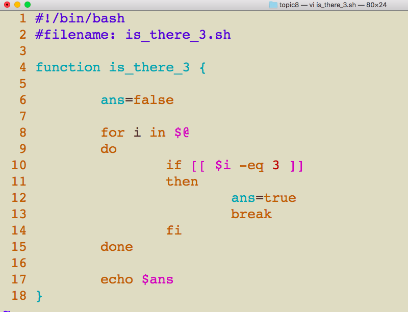

# CSCI 185 Spring 2022
# Homework 8

# Due: 23:59pm 04/27/2022
# Step 1: Write a bash script to
# Q1: Create a **Food Menu** (40 Points)
## 1.1 Print out the food menu to the user:
~~~~
1. Ice Cream
2. Yogurt
3. Salad
4. Fried Chicken
~~~~
## 1.2 Ask the user to enter the food option
## 1.3 Print out the results based on the user input. (**if-elif-else**)
## 1.4 Ask the user if he/she wants to continue or not 
## 1.5 The program continues run if the user enter `Y` or `y`, otherwise the program stops. (**while loop**) 
## 1.6 Bonus questions(5 points): Before the program stops, print the the information of the food that the user has orderd. For example:
~~~~
You got:
1 Ice Cream
0 Yogurt
1 Salad
2 Fried Chicken
~~~~
+ Hint for 1.6: define four variables and initialize them as 0, every time you entere valid number, you increase the corresponding variable by 1.
+ Sample Output
~~~~
===============================
Welcome to SAU fast food store:
===============================
1. Ice Cream
2. Yogurt
3. Salad
4. Fried Chicken
Please enter your option:
1
You entered 1
You got Ice Cream.
Do you want to continue? (Y/N)
y
1. Ice Cream
2. Yogurt
3. Salad
4. Fried Chicken
Please enter your option:
2
You entered 2
You got Yogurt.
Do you want to continue? (Y/N)
y
1. Ice Cream
2. Yogurt
3. Salad
4. Fried Chicken
Please enter your option:
3
You entered 3
You got Salad.
Do you want to continue? (Y/N)
y
1. Ice Cream
2. Yogurt
3. Salad
4. Fried Chicken
Please enter your option:
4
You entered 4
You got Fried Chicken.
Do you want to continue? (Y/N)
y
1. Ice Cream
2. Yogurt
3. Salad
4. Fried Chicken
Please enter your option:
5
You entered 5
The number you entered is not valid.
Do you want to continue? (Y/N)
n
You got:
1 Ice Cream
1 Yogurt
1 Salad
1 Fried Chicken
===============================
See you next time!
===============================
~~~~
# Q2: Echo integers from 4 to 8 twice.(40 Points)
+ The code consists of two parts
  - part 1: use brace expansion to write a for loop to echo 4 to 8.
  - part 2: use C-style for loop to echo 4 to 8
+ sample output
  ~~~~
  brace expansion:
  4
  5
  6
  7
  8
  C-style for loop:
  4
  5
  6
  7
  8
  ~~~~

  
# Q3: In the following bash script, I define a function named is_there_3 to check if a sequence of integers contains number 3 or not. How many comparisions (`$i -eq 3`) are there if I do `is_there_3 4 7 5 3 9 2 3 6` in the terminal? How many comprisions are there if I comment the `break` (line 13) in the script and run the same command in the terminal? (10 Points)

# Q4: What is the output of the following bash script? (10 Points)

~~~
for i in {0..10}
do
         if [[ $i -ne 3 ]]
         then
                 continue
         fi
 
         echo "i = $i"
done
~~~

+ Note
  - **For Q3, Q4, just comment your answer in the bash script. For example**
  ~~~~
  #!/bin/bash
  #filename: CSCI185_Homework8_JohnDoe(0123456).sh
  
  
  
  # code for Q1
  
  
  # code for Q2
  # 
  
  # answer for Q3
  # comment your answer for Q3 here, you can also echo your answer.
  
  # answer for Q4
  # comment your answer for Q4 here, you can also echo your answer.
  
  ~~~~
# Step 1: Create a bash script for Q1-Q4.
# Step 2: Please run your bash script in your terminal and make sure your bash script is working correctly before you submit.

# Step 3: Please save the code in a script file, name it as "CSCI185_Homework8_JohnDoe(0123456).sh", where 0123456 is your BeeCard number, and sumbit it on [Blackboard](https://blackboard.sau.edu/webapps/login/)

+ Note
  - The .sh file might be not allowed on Blackboard, you can zip the file then make the submission.
  - To zip the .sh file in Ubuntu, you can do **zip  'CSCI185_Homework8_JohnDoe(0123456).zip' CSCI185_Homework8_JohnDoe(0123456).sh**
  - You can also use the webbrower(firefox) in Ubuntu to submit your work.
  
