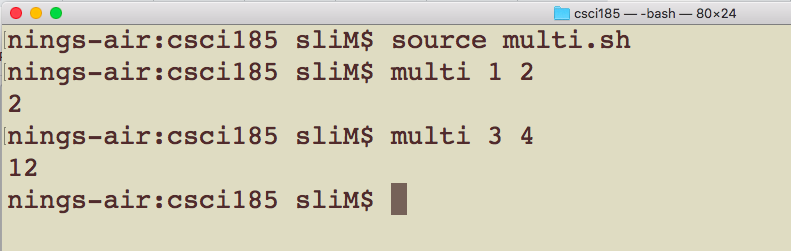
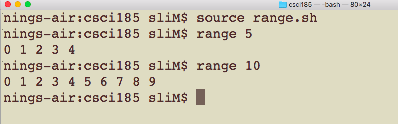
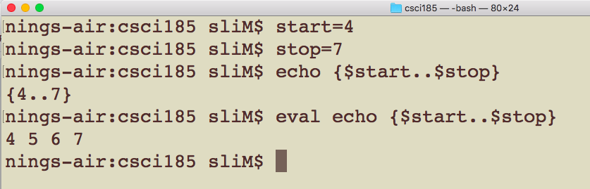
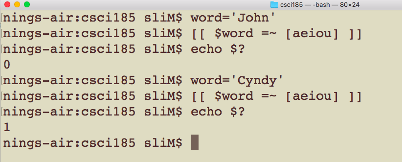
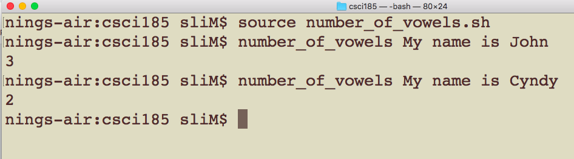

# CSCI 185 Spring 2022
# Homework 9
# Due: 11:59pm 05/02/2022

# Step 1: Write three bash scripts.
## Q1: In the first bash script, you need to define a function to calculate the multplication of two numbers(30 points).
+ You just need to find out the results of any two integers.
+ You will get 5 points as the bonus if you define a function that can deal with any two numbers (no matter they are integers or real numbers)
+ Sample output.

+ 

## Q2: In the second bash script, you need to define a function to take one integer as the argument and can print integers from 0 to the integer before the given number.

+ Sample output

+ Hint: To get the required output, see the following code

+ 

## Q3: In the third bash script, you need to define a funtion to take a sequence of words as the arguments and find the number of words which contain vowel(s).

+ Sample output

+ Hint: To find out if one word contains vowel(s) or not? See the **regex match operator =∼** in [Topic 8](../Slides/Topic%208.md) or see the follwong code

+ 

+ In the bash script, you can define a variable to store the number of word with vowel(s), you need to check each word to see if it contains a vowel or not, if so, you need to increase the number by 1.

+ This function needs a **for loop** to access each word, an **if** statement and use the match opeartor as the condition.

+ Sample output
+ 

# Step 2: Please run your bash scripts in your terminal and make sure your bash scripts are working correctly before you submit them.

# Step 3: Please zip your bash scripts , name it as "CSCI185_Homework9_JohnDoe(0123456).zip", where 0123456 is your BeeCard number, and sumbit it on [Blackboard](https://blackboard.sau.edu/webapps/login/)

+ Note
  - The .sh file might be not allowed on Blackboard, you can zip the file then make the submission.
  - To zip the .sh file in Ubuntu, you can do **zip  'CSCI185_Homework7_JohnDoe(0123456).zip' multi.sh range.sh number_of_vowels.sh**
  - You can also save all the code in one bash script named CSCI185_Homework7_JohnDoe(0123456).sh and submit this single file.
  - You can  use the webbrower(firefox) in Ubuntu to submit your work.
  
