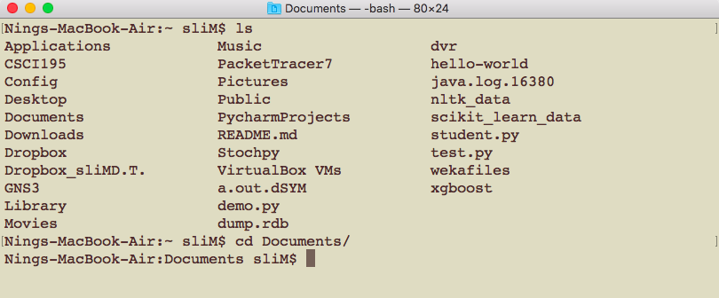
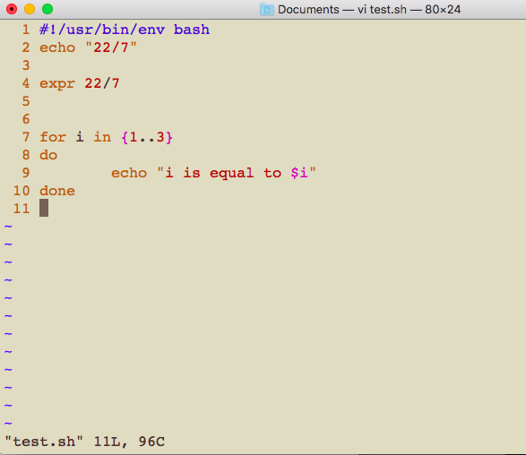

# CSCI185 Script Programming
# Spring 2022
# Topic 1: Getting Unix
## Course Introduction
+ This course is intended for folks who are new to programming and new to **Unix-like** operating systems like macOS and Linux distributions like Ubuntu.
  - [Unix vs Windows](https://www.geeksforgeeks.org/difference-between-unix-and-windows-operating-system/)
  - [Linux vs Windows](https://www.guru99.com/linux-differences.html)
+ Most of the technologies discussed in this book will be accessed via a **command line interface**.
+ You’ll also learn how to write little pieces of software in a programming language called **Bash**.
## Why Unix?
[5 reasons to learn Unix](https://www.edureka.co/blog/top-reasons-to-learn-unix-shell-scripting/)

[11 reasons to learn Bash](https://www.dataquest.io/blog/why-learn-the-command-line/)
## What is Unix?
+ Unix is an operating system and a set of tools.
  - [Kernel](https://en.wikipedia.org/wiki/Kernel_(operating_system))

+ The tool we’ll be using the most in this book is a shell, which is a computer program that provides a command line interface.
  - The shell is a very direct and powerful way to manipulate a computer.
  - There are several popular shell programs but in this book we’ll be using a shell called Bash because it’s the default shell program on Mac and Ubuntu.
+ [Linux Statistics](https://hostingtribunal.com/blog/linux-statistics/#gref)
  - Windows claims 82.56% of the world’s OS market.
  - 1.63% of all desktop operating systems worldwide ran on Linux.
  - In 2019, 100% of the world’s supercomputers run on Linux.
  - Out of the top 25 websites in the world, only 2 aren’t using Linux.
  - 96.3% of the world’s top 1 million servers run on Linux.
  - 90% of all cloud infrastructure operates on Linux and practically all the best cloud hosts use it.
## Getting Unix
### Mac & Ubuntu Users
+ If you’re using a Mac or you’re using the Ubuntu operating system find a program called Terminal and open it. You can skip the next section about Windows.
+ Note that you may need to change the default shell to bash if it is not (For Mac, check [here](https://www.howtogeek.com/444596/how-to-change-the-default-shell-to-bash-in-macos-catalina/)).
### Windows 10
If you’re using the latest version of Windows 10 you should enable and install Bash on Ubuntu on Windows. You can find the installation guide from Microsoft [here](https://docs.microsoft.com/en-us/windows/wsl/install-win10?redirectedfrom=MSDN)
### Others
#### Please Google “how to install Ubuntu on Windows with VirtualBox” 
+ Step 1: Download VirtualBox [here](https://www.virtualbox.org/)
+ Step 2: Download Ubuntu [here](https://ubuntu.com/#download)
  - Note: Choose Ubuntu Desktop
+ Step 3: Install Ubuntu 
+ Tutorials:
  - [Tutorial 1](https://www.youtube.com/watch?v=QbmRXJJKsvs)
  - [Tutorial 1](https://www.youtube.com/watch?v=BkXit-KHVsE)

#### Linux in your browser
[jslinux](https://bellard.org/jslinux/)
