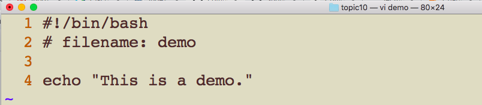
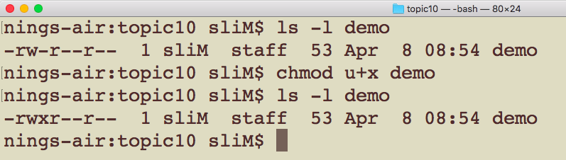
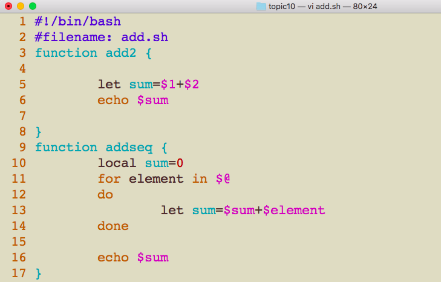
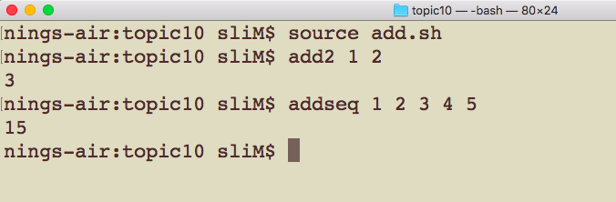

# CSCI 185 Spring 2022
# Dr. Ning Zhang
# Topic 10: Make Programs Executable and Enviromental Variables

# Making Programs Executable
+ Let’s take a detailed look at some of the code files in our current working directory(I created a new folder named topic10 and copied all the .sh file from topic9 folder):

+ The **first hyphen (-)** signifies that each of the entries in this list are **files**.
+ Excluding the first hyphen we have the following string: **rw−r−−r−−**. This string reflects the **permissions** that are set up for this file.
+ There are three permissions that we can grant: 
  - the ability to read the file (r)
  - the ability to write to or edit the file (w)
  - the ability to **execute** the file (x) as a program.
+ These three permissions can be granted on three different levels of access which correspond to each of the three sets of rwx in the permissions string:
  - The **owner** of the file
    + command `whoami` to return the current user name
    + command `id -u` to return the current user id
  - the **group** that the file belongs to
    + command `groups` to list all the groups
  - **everyone else** other than the owner and the members of a group.
  - command `ls -l` can also show the user name and group name.
  
  

+ Since you created the file you are the owner of the file, and you can set the permissions for files that you own using the **chmod** (change mode)command.

## chmod command

+ The chmod command takes two arguments.
  - The **first argument** is a string which specifies how we’re going to **change permissions for a file**
  - the **second argument** is the **path to the file**
+ The first argument has to be composed in a very specific way. First we can specify which set of users we’re going to change permissions for:

|Character|Meaning|
|---|---|
|u|The owner of the file|
|g|The group the file belongs to|
|o|Everyone else|
|a|Everyone above|

+ We then need to specify whether we’re going to add, remove, or set the permission:

|Character|Meaning|
|---|---|
|+|Add permission|
|-|Remove permission|
|=|Set permission|

+ Finally we specify what permission we’re changing:

|Character|Meaning|
|---|---|
|r|Read a file|
|w|Write to or edit a file|
|x|Execute a file|

+ Example: Let's create the following bash script.

+ Normally if we wanted to run short we would enter **bash demo** into the console.

+ If we make this file executable we would only need to enter **demo** into the command line to run the program, just like a command!

+ Let’s take a look at the permissions for **demo**.

+ We want to make this file executable and we’re the owner of this file since we created it.
+ This means we can combine **u, +, and x** in order make short executable. Let’s try it:

+ We successfully added the **x**.

+ To run an executable file we need to **specify the path to the file**, even if the path is in the current directory, meaning we need to prepend **./** to **demo**.

### Another way to do chmod: using numbers instead of letters

+ Write the permissions you want the file to have. To make your life easier, write the permissions grouped into sets of three letters. For example, we want file **demo** to have these permissions

~~~~
- rwx r-- r--
~~~~

+ Under each letter, write a digit 1; under each dash write a digit zero. Ignore the dash at the very beginning that tells you whether it’s a file or directory. This gives you three binary numbers.

~~~~
- rwx r-- r--
  111 100 100
~~~~

+ Now convert each set of three digits to a single digit using this table:

|Binary|Decimal|
|---|---|
|000|0|
|001|1|
|010|2|
|011|3|
|100|4|
|101|5|
|110|6|
|111|7|

+ From our example, the 111 100 100 translates to the number 744.

+ Now use that number in a chmod command to set your desired permissions on the file:

## Shebang:

~~~~
#!/bin/bash
~~~~

+ It's called a [shebang](https://en.wikipedia.org/wiki/Shebang_%28Unix%29). In unix-speak, # is called sharp (like in music) or hash (like hashtags on twitter), and ! is called bang. (You can actually reference your previous shell command with !!, called bang-bang). So when put together, you get haSH-BANG, or **shebang**.
+ The part after the **#!** tells Unix what program to use to run it. If it isn't specified, it will try with bash (or sh, or zsh, or whatever your $SHELL variable is) but if it's there it will use that program. Plus, # is a comment in most languages, so the line gets ignored in the subsequent execution

# Environmental Variables
+ An **environmental variable** is a variable that Bash creates where data about your current computing environment is stored.
+ Environmental variable names use all **CAPITALIZED LETTERS**.
+ Let’s look at the values for some of these variables.
  - The **HOME** variable contains the path to our home directory
  - The **PWD** variable contains the path to our current directory.

  - another example: **USER**
  ~~~~
  echo $USER
  ~~~~
+ If we want one of our functions to be available always as a command then we need to change the **PATH** variable.
+ Let’s take a look at this variable first.
  - The **PATH** variable contains **a sequence of paths** on our computer **separated by colons**.
  - When the shell starts it searches these paths for executable files, and then **makes those executable commands available in our shell**.
  - Note that your  **PATH** variable may contain a different string.

+ One approach to making our scripts available is to **add a directory to the PATH**. Then, Bash scripts in the directory that are executable can be used as commands.

+ We need to modify **PATH** every time we start a shell, so we can ammend our **∼/.bash_profile (mac)** or **∼/.profile (linux)** so that **our directory for executable scripts is always in the PATH**.

+ To modify an environmental variable we need to use the **export** keyword.
+ Let’s add a line **export PATH=“∼/Users/sliM/csci185/topic10:$PATH”** to the bottom of our **∼/.bash_profile (mac)** or **∼/.profile (linux)** so that the directory for executable script(short) is added to the PATH.
  - Note: you need to add the directory where the demo file is located.

+ Now let’s source our Bash profile.Then we should be able to use **demo** as a command!

## Another way to make a script executable

+ Alternatively to making individual scripts executable we can add a source command to our **∼/.bash_profile (mac)** or **∼/.profile (linux)** so that we can use a Bash function on the command line.

+ Now let’s source our Bash profile.Then we should be able to use **add2** as a command!

## multiple Bash functions

+ If you have multiple Bash functions that you’d like to be able to use on the command line then it’s a good idea to define these functions in one of a few files so that you don’t have to source every individual function that you want to have available.

# Summary
+ Use chmod to make your programs executable.
+ You can modify your ∼/.bash_profile (mac) or ∼/.profile (linux) in order to make scripts and functions available to use on the command line.
+ Use export to change an environmental variable.

  
