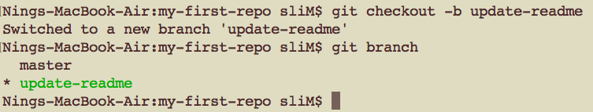

# CSCI 185 Spring 2022
# Dr. Ning Zhang
# Topic 11. Git and Github: Git

# Part I 

# What are Git and GitHub?
+ Git is a command line program which allows you to track versions of any code or plain text documents that you create.
  - Git keeps track of who made particular changes, the time and date of those changes, and where the changes were made.
    + If a critical file gets deleted by accident, or if you make a breaking change to your code and you want to try to figure out where the breaking change was made, you can use Git to restore the deleted file or find the new bug in your program.
  - Git organizes groups of files that you’re tracking into a **repository**
    + The repository is just a directory where all of the changes to files in that directory are tracked.
  - Git can also help you collaborate with others when you’re writing software.
+ GitHub is a website that provides remote Git repositories.
  - A remote repository is just a Git repository that you’re able to access over an internet connection.
    + GitHub allows you to create public or private remote repositories.
  - If you’re working on code together with a friend GitHub can help you sync changes to code files between you and your friend.
  - There’s also a social and community aspect to GitHub, since you can watch other programmers develop their projects.
  
# Setting Up Git and GitHub
+ Before setting up Git, go to [GitHub](https://www.github.com/) and create a free account. Take note of which email address you use and which username you choose.
+ To see if you have Git installed open up your terminal and enter the following:
~~~~
git --version
~~~~

+ If Git is not installed, use the tutorial [here](https://git-scm.com/book/en/v2/Getting-Started-Installing-Git).
+ After Git is installed we need to set up two environmental variables (only once)
  - 1. your GitHub user name
  - 2. the email address that you used to create your GitHub account
  ~~~~
  git config --global user.name "myUserName"
  git config --global user.email myName@email.com
  ~~~~
  
  
  
  - After the set-up, you can use the following command to show user name and email.
  
  ~~~~
  git config --global user.name
  git config --global user.email
  ~~~~
  
  
# Getting Started with Git

+ First we need to create a directory
~~~~
mkdir my-first-repo
cd my-first-repo
~~~~

+ To start tracking files with Git in a directory enter `git init` into the command line:

Note: to remove a git repository completely, including the hidden files and folders, use the following command

~~~~
rm -rf repository_name
~~~~

+ Now let’s create a file and start tracking it.

~~~
echo "Welcome to My First Repo" > readme.txt
~~~

+ We can use `git status` continuously in order to get information about the status of the Git repository.

+ As you can see readme.txt is listed as an untracked file. In order to let Git know that you want to track this file we need to use git add with the name of the file that we want to track. Let’s start tracking readme.txt:
~~~~
git add readme.txt
~~~~

+ Git is now tracking readme.txt, or in Git-specific language readme.txt is now **staged**. You can also **unstage** the file.
~~~~
git rm --cached readme.txt
~~~~

+ Our repository is right back to the way it started with readme.txt as an unstaged file. Let’s start tracking readme.txt again so we can move on to cooler Git features.

~~~~
git add readme.txt
~~~~

+ **commit**: a milestone to indicate the changes that we made.
  - A commit logs the content of all of the currently staged files.
  - When making a Git commit, we need to write a commit message which is specified after the -m flag. The message should briefly describe what changes you’ve made since the last commit.
  - the current change is `creating readme.txt`.

+ Let's add more files and change the existing file.
  - Note that we use file name `fil2.txt` on purpose.

+ if we want to track all of the changes to all of the files in our directory we should use the command
~~~~
git add -A
~~~~

+ Now the changes to all of the files in this repository are being tracked. Finally let’s commit these changes

~~~
git commit -m "added two files"
~~~

+ undo the most recent commit
~~~~
git reset --soft HEAD~
~~~~

+ then make some changes

+ Note that `mv fil2.txt file2.txt` deletes `fil2.txt` and creates a new file `file2.txt`, we need to add all the changes.

+ Finally, we make the commit.

# Summary
+ Git tracks changes to plain text files (code files and text documents).
+ A directory where changes to files are tracked by Git is called a Git repository.
+ Change your working directory, then run `git init` to start a repository.
+ You can track changes to a file using `git add [names of files]`.
+ You can create a milestone about the state of your files using `git commit -m "message about changes since the last commit"`.
+ To examine the state of files in your repository use `git status`.

# Part II

# Gitting Help, Logs, and Diffs
+ Git man page
~~~~
git help [name of command]
~~~~

+ example: `git help status` 
  - note: use `q` to quit
  

+ list all commits
  - Each commit has its time, date, and commit message recorded, along with a SHA-1 hash that uniquely identifies the commit.
~~~~
git log
~~~~

+ show the differences between unstaged changes to your files compared to the last commit
~~~~
git diff file_name
~~~~
  - Example 1: adding a line (see the plus sign before the new line)
  
  

  - Example 2: deleting a line(use vi to delete the second line of readme.txt, see the minus sign before the deleted line)
  
  
  
  - Two options for the next step
    + 1. `git add <file>` to update what will be committed
    + 2. `git restore <file>` to discard changes in working directory to to restore its content to what was present in the last commit.(If you use an early version of git, you may use `git checkout <file>` instead).
    
    
  
# Ignoring Files
+ Sometimes you might have files that you never want Git to track.
+ A file in your Git repository called .gitignore can list names of files and sub-folders, or simple regular expressions (whatever you can use with ls) in order to specify files which should never be tracked.
+ Each line of a .gitignore file should specify a file or group of files that should not be tracked by Git. 

# .git folder
+ `.git` folder contains all the git information related to one repository.
+ If you want to delete a local repository, use `rm -rf .git` to delete this repository folder first.
+ Then use `rm -r <repo-name>` to remove the repository directory.
+ Or use `rm -rf <repo-name>` directly.

# Summary
+ `git help` allows you to read the man pages for specific Git commands.
+ `git log` will show you your commit history.
+ `git diff` displays what has changed between the last commit and your current untracked changes.
+ You can specify a `.gitignore` file in order to tell Git not to track certain files.

# Part III
# Branching
+ Branching is one of the most powerful features that Git offers.
+ Creating different Git branches allows you to work on a particular feature or set of files independently from other “copies” of a repository.
+ That way you and a friend can work on different parts of the same file on different branches, and then Git can help you elegantly merge your branches and changes together.

+ **git branch**: 
  - `git branch` lists all of the available branches.
    + The star (`*`) indicates which branch you’re currently on.
    + The default branch that is created is always called `master`. Usually people use this branch as the working version of the software that they are writing, while they develop new and potentially unstable features on other branches.

  
  
  - `git branch <branch_name>` creates a branch.
  
  
  
  - `git checkout <branch_name>` changes the current branch.
  
  
  
  - `git status` also shows the current branch.
  
  

  - `git branch -d <branch_name>` deletes a branch(switch back to `master` first).
  
  
  
+ <b> Edit a non-master branch </b>
  - `git checkout -b <branch_name>` can create and switch to a new branch at the same time.
  
  
  
  - make some changes to readme.txt file, then commit.
  
  
  
  - switch back to `master` branch, we can see no changes in readme.txt
    + you can see how you can make incremental edits to plain text (usually code files) without effecting the master branch.

    
  
+ `git merge <branch-name>` merges the changes in a non-master branch to the master(the current/`base` branch must be master.)

 

 

+ **conflict**: there are two commits in two separate branches that make different edits to the same line of text.

   

+ we can use `git status` to find suggestions to fix the conflict and `cat readme.txt` to see more details.
  - In Git terminology the HEAD represents the most recent commit on the branch which is currently checked out.
  
  
  
+ In order to resolve this conflict, all we need to do is open readme.txt with vim or other text editor so we can delete the lines we want to get rid of.

# Find more in open source book: [Pro Git](https://git-scm.com/book/)

# Summary
  
+ Git branching allows you and others to work on the same code base together.
+ You can create a branch with the command `git branch [name of branch]`.
+ To switch to a branch use `git checkout [name of branch]`.
+ You can combine a branch with your current branch by using `git merge`.
