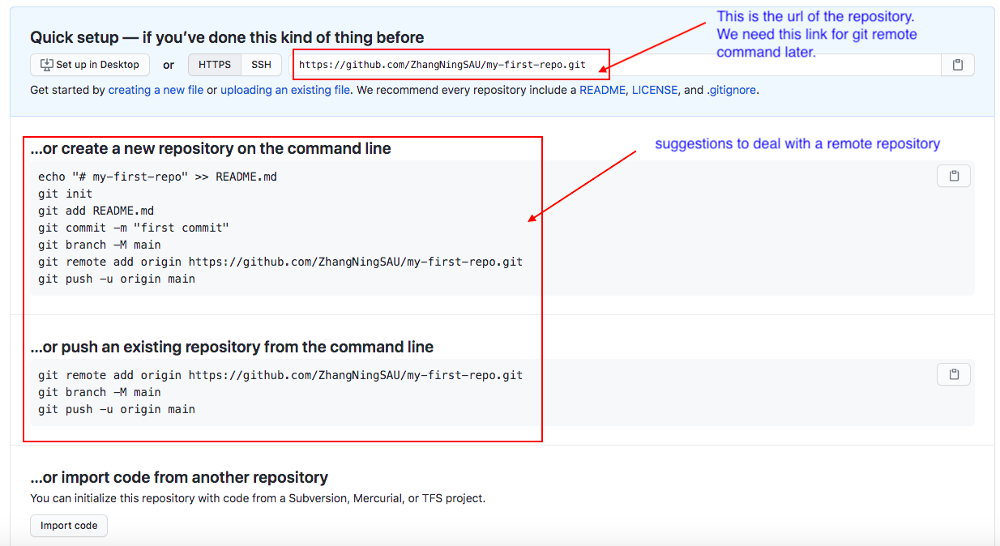

# CSCI185 Spring 2022
# Topic 12: Git and Github: Github

# Create a repository on Github
+ Go to [Github](https://github.com/) and sign in with your username and password.


+ Two different ways to create a repository


+ Create a reposity called `my-first-repo`
  - Note that `my-first-repo` is the local repository we created in [Topic 11](../Slides/Topic11.md). If you copy/create the repository in a new folder, you need to create the Git repository again.


+ You should see a page like this:




+ By now, we have a local repository on my computer and a remote repository on Github.
  - A remote Git repository is just a Git repository stored on a computer is that always turned on and connected to the internet.
  - so it can act as a central point where we can share and sync our changes to files with our friends and colleagues.
  - We can see which remote repositories our local repository is connected to with the `git remote` command while we have our working directory set to `my-first-repo`:
  
  
  
  
+ Now let’s add the new GitHub repository as a remote in the local repository:
  - `origin` is the name we’re assigning to this remote repository. We will explain why we choose this name later.
  - `https://github.com/ZhangNingSAU/my-first-repo.git` is the URL of the remote repository. You need to replace it with your own url.
~~~~
git remote add origin https://github.com/ZhangNingSAU/my-first-repo.git
~~~~

+ Use `git remote to check the result`


+ You can also remove a remote by its name(in our case `origin`)
~~~~
git remote rm origin
~~~~


+ `git push` updates a remote repository with all of the commits that we’ve made to our local Git repository.
  - for the first `git push`, you need to add `- u` flag in order to set `origin` as the default remote repository so we don’t have to provide its name every time we want to interact with it.
  - If you have the following prompt (on Mac), you can use the following command to erease the github credentials you stored.

  
   
  ~~~~
  git credential-osxkeychain erase
  host=github.com
  protocol=https
  ~~~~
  
  - If the password does not work

  

  - Use this [`link`](https://docs.github.com/en/github/authenticating-to-github/creating-a-personal-access-token) to create a token and use this token as the password

  
  
  - Then, you can get an updated webpage for the remote repository on Github
  
  
  
# Markdown
+ One neat feature of GitHub is that readme files are rendered on the repository page so you can write documents which explain the contents of your repository.
+ Instead of using a `readme.txt`, better to learn how to use `Markdown` instead

+ Markdown is a markup language (e.g., HTML).
+ Markup languages are sets of rules for adding decorative features to text.
+ GitHub transforms Markdown files (which end in the file extension .md) into simple HTML web pages in your repository.
+ If there is a file called README.md in any folder in your repository, then that file is rendered to HTML and displayed on GitHub.
+ Let's remove `readme.txt` and add the following content to `README.md`.(you can use VI as the text editor)

~~~~
# This is a large heading
## This is a smaller heading

And as **imagination** bodies forth,
The forms of things *unknown*, the poet's pen,
Turns them to shapes and gives to airy nothing,
A local *habitation* and a **name**.

- This is 
- an unordered
- list

1.  This is
2.  an ordered
3.  list

```
thi is 
a block 
of code
```

Here is how you make [a link](https://www.wikipedia.org/).


~~~~

+ Commit the changes and push the changes to remote repository.


+ Check the remote repository again, you can find out:
  - Pound signs (`#, ##`) make headings.
  - A word surrounded by single asterisks (`*word*`) makes that word *italicized*.
  - A word surrounded by double asterisks (`**word**`) makes that word **bold**.
  - You can create lists with hyphens (`-`) or numbers (`1., 2., 3.`).
  - Code can be placed in the middle of a line with single backticks (``code``).
  - Acodeblockcanbecreatedbyputtingcodeinbetween a set of triple backticks.
  - You can insert a link with brackets and parentheses.
  - You can use an image with an exclamation point, and a link to an image.

+ Other MarkDown resources
  - [Mastering MarkDown](https://guides.github.com/features/mastering-markdown/)
  - [Markdown book](https://github.com/seankross/the-unix-workbench/blob/master/docs/06-Git-and-GitHub.md)
  - [In-browser MarkDown Editor](https://jbt.github.io/markdown-editor/#TVFLbtwwDN3rFCxm0xgTOU133WXXA2QXFDDHYizWEmlIctzZLwDPEeuYA8hYZkIImFgmZw7HP6r1YwpUXmvPkkArNB1nHFiwcYqXQcnDUwVXrW0eHTPkfYwV9BXaNGIxlh+qrCQGGEtUvd8hqZQIy4mhtZq4jeLLIdcziB6ETu6J0g6YoIu4onb3yEueLTJBDN1nXfu/rqIRSiwipZAhYJ9E9fm3Cd/Qzz6HXIFfPb/EF/tu19iqJoJRg00AMtlg8whJNo3tDORNJKRrOkwDO4qinCyOWdnmJ16O1jbG2pX/p+2za/8cwLBUavZervTPzDy80agd0B8u+UiVtcT37U3J85rtz/wGLXQukLJcJKtQ9mQFIM/duDf/CP/Ywl3Wdda8Mxkv++THd/AA==)

# Fix Git always asking for user credentials
+ If you find you need provide the username and password every time you do the command `git push`, you can find a solution [here](https://www.freecodecamp.org/news/how-to-fix-git-always-asking-for-user-credentials/)
+ Note that you may need to restart the terminal after running the command to save your credentials.

# Pull Requests
+ A pull request allows you to interactively compare two different branches before you merge them so you can either go ahead with the merge or provide feedback to whoever opened the pull request.
+ Essentially a pull request allows a person to ask another person if they’re willing to incorporate changes on one branch into another branch.
+ This social coding transaction may involve you and a collaborator, you and a stranger, or you might open a pull request on your own repository just as a method of staying organized.

+ Let's learn how to `open a pull request` on our own repository by using `update-readme` branch.

~~~~
git checkout update-readme
~~~~

+ If we take a look at the files in this branch, the `readme` file has not been updated, we can do it by merging the `master` branch.


+ Let's only keep the `README.md` file and revise the file a little bit (I simply copy the content from the textbook). Then save the change, make a commit, and push the commit to `update-readme` branch on Github.
~~~~
# Sean Kross
### Geography
I live in the city of Baltimore, in the state of \ Maryland, in the United States
of America.
### Reading
Three of my favorite books are:
- *Mindstorms* by Seymour Papert
- *Welcome to the Monkey House* by Kurt Vonnegut
- *Persepolis* by Marjane Satrapi
### Food
Last night I dreamt about eating in these restaur\ ants:
1. Linger in Denver.
2. Azura in Jerusalem.
3. Gemma in New York City.
### Contact
The best way to get in touch with me is [on Twitt\ er](https://twitter.com/seankross).
~~~~


+ Note:
  - Notice that we needed to specify which remote we were pushing to since GitHub didn’t previously know about the existence of the `update-readme` branch.
  - When you perform a git push, only the commits on the current branch are sent to the remote repository. 
  - That way you can create local branches that cannot be accessed from the remote repository, unless you explicitly push them to GitHub.

+ Now, we can see the `update-readme` branch on Github. You can switch between different branches and see the differences.


+ `open a pull request`
  - A pull request is like a guided `git merge` that is facilitated by GitHub.
  

  
  - To start the pull request click the `New pull request` button. On the new page:
    + The branch name after “base:” shows the branch that changes are being merged into (in this case the master branch).
    + the branch name after “compare:” shows the branch that has the changes (in this case the update-readme branch).
    + the comment area
    + line-by-line comparisons
    + green `Create pull request` button to open the pull request
+ After clicking the green `Create pull request` button, a new page:


  -  three tabs: `Conversation`, `Commits`, and `Files changed`
  -  In the `Conversation` tab we can add comments to the pull request which can be formatted with Markdown.
  -  The `Commits` tab lists the commits that have been made to the “compare” branch in this pull request.
  -  the `Files` changed tab shows the same line-by-line comparison we saw before.

+ Once you’re ready go back to the `Conversation` tab and click the green `Merge pull request` button, then click the green `Confirm merge` button that appears. This will git merge the `compare` branch into the “base” branch on our remote repository.
+ it’s important to keep your local repository up to date with the latest changes in the remote repository.
~~~~
git checkout master
git pull
~~~~
# Pages
+ GitHub Pages allows you to create and host a website on GitHub using only Git and Markdown.
+ Go back to your `my-first-repo` repository page on GitHub on click the `Settings` tab at the top. Scroll down the page until you see a box that says `GitHub Pages`. Then click on the drop-down menu that says `None`.


+ Click `master` branch and then click `Save`. Now go to the website `[your-github-username].github.io/my-first-repo` (in my case the address is zhangningsau.github.io/my-first-repo)
+ If you want to change your new website all you need to do is edit your README.md then commit and push the changes! 
+ More information [here](https://pages.github.com/).


# Forking
+ Forking a GitHub repository copies somebody else’s GitHub repository into your GitHub account.
+ You can then modify this copy of their software however you like.
+ After you’ve added some commits to your copy of the repository you can keep the new commits to yourself, share them with others, or you can open up a pull request for your new commits to be merged into the original source repository.
+ This original source repository (the repository you forked) is often called the `upstream` repository.
+ Let's fork a repository here: https://github.com/seankross/the-unix-workbench and click the `Fork` button in the upper right corner. 


+ use the git clone command to get a local repository.


+ In terminal, choose your path and do `git clone` command


+ associate remote repository with the local repository

~~~
git remote -v
~~~

+ then make changes and commits
~~~~
echo "- Ning Zhang" >> guestbook.md
cat guestbok.md

git add guestbook.md
git commit -m "added my name to guestbook.md"
git push
~~~~


