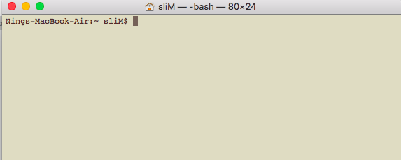
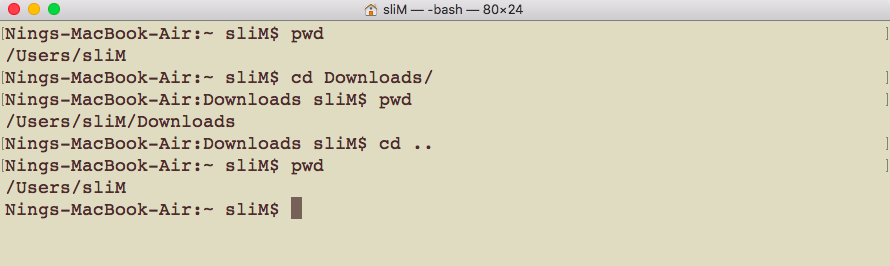

# CSCI 185 Spring 2021
# Topic 2: Command Line Basics

# Part I: Hello terminal
## Open your Shell
+ Ubuntu: click on the "Search" or "Applications" icon on the left side, and search for "Terminal"
  - 
+ Mac: click on the "Spotlight Search" icon at the top-right corner and search "Terminal"
  -[Mac Terminal](https://apple.blogoverflow.com/files/2012/02/Terminal.png)
## Verify your Shell version(We use Bash in this class)
+ Once you have opened up a Terminal, you should see a window that looks something like this, this is called a **shell**

+ We can type "$SHELL --version" then enter to get the shell version.
  

+  Note that some version of MAC OS, such as "catalina", uses **zsh** as the default shell. If you find the output of "$SHELL --version" is **zsh**, you can find "Terminal->Preference->General->Shells open with->Command(complete path)", and change it to **/bin/bash**

## Prompt
+ As you can see in my shell it says "Nings-MacBook-Air:~ sliM$". This string of characters is called the **prompt**.
+ The prompt ends with the dollar sign $.
+ The prompt is just there to let you know that the shell is ready for you to type in a command.

## Enter
+ Press **Enter** on your keyboard a few times to see what happens with the prompt.
+ If you don’t type anything after the prompt and you press enter then nothing happens and you get a new prompt under the old one.

## Clear up your shell (clear command)
+ Type **clear** at the prompt and then hit **enter**.

+ Your shell is back to how you started.

## Command Structure
+ Every command line command is actually a little computer program, even commands as simple as clear.
+ These commands all tend to have the following structure.

~~~~
[Command][Options][arguments]
~~~~

+ Some simple commands like **clear** don’t require any options or arguments.
+ Options are usually preceded by a **hyphen** (-)

+ Arguments can be names of files, raw data, or other options that the command requires.

## echo Command
+ A simple command that has an argument is **echo**.
+ The echo command prints a phrase to the console.
+ Enter **echo ‘Hello World!’** into the command line to see what happens

+ You can use echo to print any phase surrounded by a paire of single or double quotes to the console.

## Up and Down arrow keys

+ If you want to see the last command press the Up arrow key.
+ You can press Up and Down in order to scroll through the
history of commands that you’ve entered.
+ If you want to re-execute a past command, you can scroll to that command then press Enter.
+ Try getting back to the echo ”Hello World!” command and execute it again.

## Summary
+ You type command line commands after the prompt.
+ **clear** will clean up your terminal.
+ **echo** prints text to your terminal.
+ You can scroll through your command history with the **Up** and **Down** arrow keys.

# Part 2: Navigating the Command Line

## Navigation of files and folders
+ We’ve learned two command line commands (**clear** and **echo**) so far! Before we learn more commands we need to discuss how files and folders are organized on your computer.
+ Computers are organized in a hierarchy of folders, where a folder can contain many folders and files.
+ People who use Unix often refer to folders as **directories** and these terms are interchangeable.
+ This directory hierarchy forms a tree, like the diagram below.
+ You can use the command line to navigate these trees on your
computer.
+ As you can see in the image below, my Action directory is
contained in my Movies directory. This is the simplest case of how directories are structured.

+ The directory structure on most computers is much more complicated, but the structure on your computer probably looks something like this:

+ There are a few special directories that you should be aware of on your computer.
+ The directory at the top of this tree is called the **root directory**.
+ The root directory contains all other directories, and is represented by a **slash** (**/**).

+ The **home directory** is another special directory that is represented by a **tilde** (**∼**).
+ Your home directory contains your personal files, like your photos, documents, and the contents of your desktop.
+ When you first open up your shell you usually start off in your home directory.

+ Imagine tracing all of the directories from your root directory to the directory you’re currently in. This sequence of directories is called a **path**.
+ The diagram below illustrates the path from a hypothetical root directory to the home directory.

+ The following path can be written as /Users/your_user_name.

+ Open the command line, your shell starts in your home directory.

## pwd command

+ Whatever directory your shell is in is called the **working directory**.
+ Enter the **pwd** command into your shell to **p**rint the **w**orking **d**irectory.

## ls command
+ We can **list the files and folders** in a directory using the **ls** command.

## cd command
+ You can change your working directory using the **cd** command.
+ If you use the cd command without any arguments then your working directory is changed to your home directory. (this is equivelant to "cd ~")

+ To use cd to change your working directory to a directory other than your home directory, you need to provide **cd with the path to another directory as an argument**.

+ Now let’s switch into a directory (**Downloads** for example).
+ As you can see the path to the current working directory has
changed.

+ We can go back to the parent folder with the command **cd ..**, which changes the working directory to the folder above the current working directory:

+ We can cd to any folder as long as we know the path to that folder. For example:
  - suppose we are in **User/sliM/Downloads**
  - we want to cd to **User/sliM/Desktop/tmp** (of course, this folder exists)
  - we can do **cd ~/Desktop/tmp** (what does the tilde mean?)
  

## tab completion
+ Of course you shouldn’t expect yourself to have every absolute path on your computer memorized!
+ You can use a terminal feature called **tab completion** in order to speed up typing paths and other commands.
+ Enter **cd ~/D** into your shell, and then try pressing the **Tab** key (on some machines you need to press it twice):
+ only folders with names that start with a “D” are listed.

+ If I type **cd ∼/De** into the console and then press Tab then the command will auto complete to cd ∼/Desktop/.

## Summary
+ You can identify a specific file or folder by its **path**.
+ The **root directory (/)** contains all of the folders and files on
your computer.
+ Your **home directory (∼)** is the directory where your terminal always starts.
+  The **cd** command changes your working directory.
+  The **pwd** command prints the working directory.
+ The **ls** command lists files and folders in a directory.

# Part 3: Create files and folders
## Create a new folder
+ We’ll start to learn some actions you can perform on folders and files. One of the first actions when opening up a new terminal is to create a new folder or file.
+ You can **m**a**k**e a **dir**ectory with the **mkdir** command, followed by the path to the new directory.
+ Let’s use the mkdir to create a new directory called **topic2** in folder csci185:

## Create a new file
+ There are a few different ways to create a new file on the command line.
+ The most simple way to create a blank file is to use the **touch** command, followed by the path to the file you want to create.
+ Let’s create a new empty file readme.txt using touch:

+ Another easy way to create a file is using **output redirection**: **>**.
+ Output redirection stores text that would be normally printed
to the command line in a text file.
+ You can use output redirection by typing the greater-than sign (**>**) at the end of a command followed by the name of the new file that will contain the output from the proceeding command.
+ Let’s try an example using echo:

## Print a file
+ Now we can try printing the text file to the console using the **cat** command.
+ The cat command is often used to print text files to the terminal, despite the fact that it’s really meant to con**cat**enate files.

## Append text to the end of a file
+ We can also append text to the end of a file using two greater-than signs (**>>**).
+ Let's try to add "Banana" to fruit.txt

+ Mistake Warning! Imagine that if we want to append another line to the end of fruits.txt, and we typed echo ‘Strawberry’ > fruits.txt into the terminal by mistake while the correct command should be echo ‘Strawberry’ >> fruits.txt
+ Unfortunately this mistake has unintentionally overwritten what was already contained in fruits.txt.

+ There are a few strategies for protecting yourself from mistakes, including managing permissions for files, and tracking versions of your files with Git, which we will discuss thoroughly in a later topic.

## Review: Command Structure

~~~~
[Command][Options][arguments]
~~~~

## Command Options
+ We’ve been using ls to list the files and folders, but using ls alone doesn’t differentiate between which of the listed items are folders and which are files.(e.g. I did "touch tmp" to create a file named tmp, but we can not tell if tmp is a file or folder by using "ls" )

+ We can use the **-l** option with ls in order to get a **long listing of files** in a directory.

+ There is a row in the resulting table for each file or folder.

+ If the entry in the first column is a **d**, then the row in the table corresponds to a **directory**, otherwise the information in the row corresponds to a file.

+ The string of characters following the d in the case of a directory or following the first - in the case of a file represent the permissions for that file or directory. We’ll cover permissions in a later section.

## Summary
+ Use **mkdir** to create new directories.
+  Use **touch** command creates empty files.
+ Use **>** to redirect the output of a command into a file.
+ Use **>>** to append command output to the end of a file.
+ Use **cat** to print a text file to the command line.
+ Use **-l** option with **ls** to get a long listing of files.
