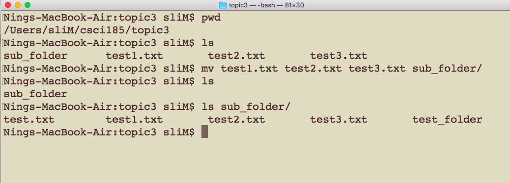

# CSCI 185 Spring 2022
# Dr. Ning Zhang
# Topic 3: Working with Files and Folders

# Part 1: Inspecting Files and Folders

## wc command
+ We’ve learned how to create a file in different ways. Now we can inspect the file in different ways.
+ First let’s use the **wc** command to view the **w**ord **c**ount and other information about the file.
+ The wc command displays the **number of lines** in a file followed by the **number of words** and then the **number of characters**.
+ The following example shows that the fruit.txt file has 4 line, 5 words and 31 characters.

+ The **-l** option is used for counting the **number of lines** in a file only.
+ The **-w** option is used for counting the **number of words** in a file only.
+ The **-c** option is used for counting the **number of characters** in a file only.

+ wc command can take **multiple filenames** as arguments.
+ If multiple filenames are specified with wc command then it will produce a separate line of output for each file along with an additional line as a total count for all files specified.
+ For example:

## less
+ We’ve learned how to view a file using cat command.
+ Now let’s take a look at how we could view a larger file.
+ Let’s examine the [earthquakes.txt](https://raw.githubusercontent.com/ZhangNingSAU/Spring-2022-CSCI-185-Script-Programming/main/Resources/earthquakes.txt) file to see if it’s reasonable to read it with cat.
  - You can use `wget https://raw.githubusercontent.com/ZhangNingSAU/Spring-2022-CSCI-185-Script-Programming/main/Resources/earthquakes.txt` to download the file to the current folder, or you can open the URL and save the file. 
  - If you need to copy the `URL` from your main OS to Ubuntu, please see the tutorial [here](https://o7planning.org/11879/how-to-copy-and-paste-between-your-computer-and-virtualbox)
+ Wow, over 6000 lines! If we use cat on this file it’s liable to take up our entire terminal.
  - You can use `wc` command to check the number of lines.

+ Instead of using cat for this large file we should use **less**, which is a program designed for viewing multi-page files.

+ Let’s try using less command, and then press the enter key.

+ You will enter the less view mode after you press the enter key.
+ As you can see the **less program** is a kind of Unix tool with
behavior that we haven’t seen before because it **“takes over”** your terminal. There are a few programs like this that we’ll discuss throughout this class.

+ You can **scroll up** and **down** the file **line-by-line** using the **up** and **down arrow keys**.
+ If you want to scroll faster you can use the **spacebar** to go to the **next page** and the **b** key to go to the **previous page**.
+ In order to **quit less and go back to the prompt**, press the **q** key.

## head and tail
+ There are also two easy to remember programs for glimpsing the beginning or end of a text file: head and tail.
### head
+ Let’s quickly use head on the earthquakes.txt
+ As you can see **head** prints the **first ten lines** of the file to the terminal.

+ You can specify the number of lines printed with the -n option followed by the number of lines you’d like to see.
+ The following example prints the first 3 lines of the earthquakes.txt to the terminal.

### tail
+ Let’s quickly use tail on the earthquakes.txt
+ As you can see **tail** prints the **last ten lines** of the file to the terminal.

+ You can specify the number of lines printed with the -n option followed by the number of lines you’d like to see.
+ The following example prints the last 3 lines of the earthquakes.txt to the terminal.

## more about ls
### ls with argument
+ We can **specify the path of the folder** you want to inspect.

### dealing with hidden folders and files
+ a hidden folder or hidden file is a folder or file which filesystem utilities do not display by default when showing a directory listing.
+ They are commonly used for storing user preferences or preserving the state of a utility, and are frequently created implicitly by using various utilities.
+ In Unix-like operating systems, any file or folder that starts with a **dot** character (for example, /home/user/.config), commonly called a dot file or dotfile, is to be treated as hidden.
+ The ls command does not display the hidden files unless the **-a flag (ls -a)** is used.

## Summary
+  wc command to view the word count and other information about the file.
+  less command to view multi-page files.
+  head command to print lines of file to the terminal.
+  tail command to print lines of file to the terminal.
+  ls with argument.
+  ls with -a option.

# Part 2: Moving, Renaming, Copying, and deleting files and folders

## Objectives
+ In this section we’ll discuss moving, renaming, copying, and deleting files and folders.

## mv command
+ First let’s use the **mv** command to **m**o**v**e the file or folder to another folder.
+ mv takes two arguments: 
  - first the **path to the file or folder that you wish to move**
  - scond  **the destination folder**.
+ The following example move the text file test.txt from the current working directory( topic3 folder) to the **sub_folder** folder.

+ You also can move a folder to another folder.

Note: The slash / after the folder name is added by tab completion automatically.

+ You also can **move a group of files to another folder**.

 Note: instead of cd to sub_folder and ls, we can ls sub_folder directly.

+ Another hidden use of the mv command is that you can use it to **rename files and folders**.
+ The first argument is the path to the folder or file that you want to rename, and the second argument is a path with the new name for the file or folder.
+ The following example rename the file test.txt to demo.txt.

+ You also can rename a folder.
+ The following example rename the folder **sub_folder** to the **new_folder**.

+ **Warning!!!!!!!**
+ **If the destination file already exists, then the contents of this file will be overwritten with the contents of a source file.**

+ In the following example, the content of test.txt will be overwritten by demo.txt

+ By default, the mv command doesn’t prompt when the operation involves overwriting an existing file.
+ However, if you want, you can force mv to prompt by using the **-i  option**.
+ The following example shows that -i leads to mv asking for user permission before overwriting an existing file.

## cp command

+ Similar to the mv command, the **cp** command copies a file or folder from one location to another.
+ As you can see **cp** is used exactly like mv when copying files, the file or folder you wish to copy is the first argument, followed by the path to the folder where you want the copy to be made.
+ The following example copies the text file demo.txt to the sub_folder folder.

+ Be aware that there is one difference between copying files and folders, **when copying folders you need to specify the -r option**, which is short for recursive.

+ This ensures that the underlying directory structure of the directory you wish to copy remains intact.

+ You also can copy a group of files to another folder.

## rm command
+ Finally, let’s discuss how to delete files and folders with the command line rm.
+ When **r**e**m**oving files rm only requires the path to a file in order to delete it.
+ The following example deletes the file test.txt. The file **test.txt** is **gone forever**.

+ You also can delete folders just like when we were using cp the **rm command requires you to use the -r option when deleting entire directories**.

+ The following example deletes the **new_folder** folder. The whole folder is **gone forever**.

+ You also can remove a group of files.

+ Like in mv command, -i option is also used with rm command for interactive deletion.
+ The prompts asks the user for confirmation before deleting the files.

+ **A word of extreme caution**: in general it is not recommended deleting files or folders on the command line because there is no undo button on the command line.

+ I highly recommend moving files or folders to a designated trash folder and then deleting them the way you would normally delete files and folders outside of the command line.

## Summary
+ mv command to move or rename files or folders. 
+ cp command to copy files or folders.
+ rm command to remove files or folders.
+ You should try to avoid using rm which permanently removes files or folders.

