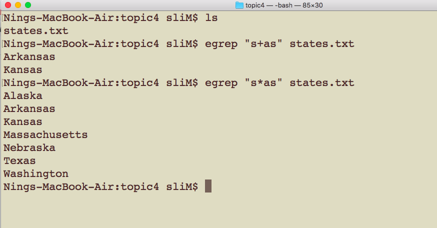

# CSCI 185 Spring 2022
# Dr. Ning Zhang
# Topic 4: 

# Part I: Help command and Wildcards

## man command
+ Each of the commands that we’ve discussed so far are thoroughly documented.
+ You can view their documentation using the **man** command, where the first argument to man is the command you’re curious about
+ Let’s take a look at the documentation for rm:

+ You will enter the view mode after you press enter.
+ The controls for navigating man pages are the same as they are for **less** command.
  - up, down arrow keys 
  - space and b keys

+ Let’s say that I forgot how to get rm with user’s permission. After typing man rm to open the page, type **/** in order to start a search.
+ Then type the word or phrase that you’re searching for, in this case type in **permission** and then press Enter:

+ The page jumps to the following entry:
+ Press the **n** key in order to search for the next occurrence of
the word, and if you want to go to the previous occurrence
type **Shift + n**.
+ This method of searching also works with less. When you’re finished looking at a man page type **q** to get back to the prompt.

+ Note: The number corresponds to what section of the manual that page is from
~~~~
MANUAL SECTIONS
    The standard sections of the manual include:

    1      User Commands
    2      System Calls
    3      C Library Functions
    4      Devices and Special Files
    5      File Formats and Conventions
    6      Games et. al.
    7      Miscellanea
    8      System Administration tools and Daemons

    Distributions customize the manual section to their specifics,
    which often include additional sections.
~~~~

## apropos command
+ The **man** command works when you know which command you want to look up. But what if you’ve forgotten the name of the command you’re looking for?
+ You can use **apropos** to search all of the available commands and their descriptions.
+ For example you don’t know the command to display calendar. You could type apropos calendar into the command line which will print a list of results:

+ Let’s try `cal` and `ncal` in the terminal line.
+ You also can use man command to get more detailed information of `cal` and `ncal` commands, try it by yourself.

+ Both `man` and `apropos` are useful when a search is only a few keystrokes away.
+ But if you’re looking for detailed examples and explanations you’re better off using a search engine if you have access to a web browser.
+ If you have access to a web browser, using a search engine might be better than `man` or `apropos`.

## WildCard
+ wildcard is a powerful tool for working with groups of files that are similarly named.
+ A **wildcard** is a character that represents other characters, much like how joker in a deck of cards can represent other cards in the deck.
+ Wildcards are a subset of metacharacters, a topic which we will discuss in detail later on in this chapter.
+ **The * (“star”) wildcard represents zero or more of any character**, and it can be used to match names of files and folders in the command line.
+ **The question mark (?) is used as a wildcard character in shell commands to represent exactly one character**, which can be any single character.
### Star Wildcard
+ Let’s walk through a few other examples of using the star wildcard. For example, we could only list the photos starting with “2019” (ls 2019*):
+ As you can see, only the files start with 2019 are listed!

+ Let’s organize these pictures by year. First let’s create one directory for each year of photos (2019, and 2020):

+ Now we can move the photos using wildcards.
+ We’ve moved all files that start with “2019-”’ into the 2019 folder and “2020-”’ into the 2020 folder.

+ Qustion: What if I type "mv 2019* 2019" and "mv 2020* 2020"

+ If we want to list all of the jpg picture in my Pictures directory we could do the following (ls *.jpg)
  - Note: Let's mv the photos back from 2019 and 2020 folders, how can we do that?
+ As you can see, only the files with extension .jpg are listed!
+ + The command ls *.jpg literally means: list the files start a sequence of zero or more of any character but the file name must end in “.jpg”

+ We could also list only the photos on a specific date (ls *01-01*).

+  All of the files have names that are composed of a sequence of characters, followed by the adjacent characters 01-01, followed by another sequence of characters.

### Question Mark Wildcard
+ The **question mark (?)** is used as a wildcard character in shell commands to represent **exactly one character**, which can be any single character.
+ Thus, **two question marks in succession would represent any two characters in succession, and three question marks in succession would represent any string consisting of three characters.**

+ example

+ The question mark wildcard can also be used in **combination with other wildcards** when separated by some other character.

+ For example, the following would return a list of all files in the current directory that have a three-character filename extension:

### There are two things which * and ? cannot match.
+ First, they cannot match filenames starting with a **dot (.)**
+ Second, they cannot match **/** in the pathname. For example, we cannot use cd **/usr?local** to switch to **/usr/local**. It will generate an error.

## Square Brackets Wildcard
+ The third type of wildcard in shell commands is **a pair of square brackets**, which can represent **any of the characters enclosed in the brackets**.
+ If the first character in the brackets is a caret (∧), it matches any character except those in the string.
  - For example
    + [abc] matches a, b, or c
    + [∧abc] matches any character but not a, b, or c.
  
+ A **minus sign (-)** within square brackets indicates a range of consecutive ASCII characters.
  - For example 
      + [0-9] is the same as [0123456789]. 
      - The minus sign loses its special meaning if it’s the first (after an initial ∧, if any) or last character in the string.

## Summary
+ **man** command to loop up the documentation of UNIX commands.
+ **apropos** to search for a word associated with that command.
+  **Star wildcard** * represents or matches one or more occurrences of any character, including no character.
+ **Question mark ?** represents or matches a single occurrence of any character.
+ **Bracketed characters [ ]** represents or matches any occurrence of character enclosed in the square brackets.

# Part 2: Search through files and folders

## Regular expression
+ The ability to **search** through files and folders can greatly improve your productivity using Unix.
+ First we’ll cover searching through text files .
+ Let’s download a list of the names of the states in the US (states.txt), which you can find in the following link: http://seankross.com/notes/states.txt

  - note: 
    + You can use either the webbrowser or the following command to download it.

    ~~~~
    wget "http://seankross.com/notes/states.txt"
    ~~~~

    + To install wget on MacOS, you need to install brew first, then wget
    
    ~~~
    ruby -e "$(curl -fsSL https://raw.githubusercontent.com/Homebrew/install/master/install)"
    brew install wget
    ~~~
    
    + To install wget on Ubuntu
    
    ~~~
    apt install wget
    ~~~

+ Let’s take a look at this file. This file looks basically how you would expect it to look.
+ For now all you need to know is that text data are called strings. A string could be a word, a sentence, a book, or a file or folder name.

+ One of the most elective ways to search through strings is to use **regular expressions**.
+ **Regular expressions** are strings that define **patterns** in other strings.
+ You can use regular expressions to **search** for a sub-string contained within a larger string, or to **replace** one part of a string with another string.
+ [One tutorial](https://docs.microsoft.com/en-us/dotnet/standard/base-types/regular-expression-language-quick-reference?redirectedfrom=MSDN)

### grep

+ One of the most popular tools for searching through text files is **grep**.
+ The simplest use of grep requires two arguments: **a regular expression** and **a text file to search**.
+ Let’s see a simple example of grep in action:
  - In the following example, the first argument to grep is the regular expression “x”. The “x” regular expression represents one instance of the letter “x”.
  - Every line of the states.txt file that contains at least one instance of the letter “x” is printed to the console.
  - As you can see New Mexico and Texas are the only two state names that contain the letter “x”.

+ Let’s try searching for the letter “q” in all of the state names using grep.
+ Nothing is printed to the console because the letter “q” isn’t in any of the state names

+ We can search for more than individual characters though.
+ For example the following command will search for the state names that contain the **word** “New”:
+ **Question**: What if **grep "new" states.txt**

+ Regular expressions are **not limited to just being individual characters or words**, they can also represent **parts of words**.

+ For example we could search all of the state names that contain the string **“nia”** with the following command:

#### egrep

+ Regular expressions aren’t just limited to searching with characters and strings, the real power of regular expressions come from using **metacharacters**.
+ **Metacharacters are characters that can be used to represent other characters.**
+ To take full advantage of all of the metacharacters we should use grep’s cousin **egrep**, which just extends grep’s capabilities.

+ The first metacharacter we should discuss is the **“.” (period) metacharacter**, which represents any character.

+ If for example I wanted to search states.txt for the character “i”, followed by any character, followed by the character “g” I could do so with the following command.

+ The period metacharacter is a stand-in for the “r” in “irg” and the “n” in “ing” in the example below.

+ Besides characters that can represent other characters, there are also metacharacters called **quantifiers** which allow you to specify the **number of times** a particular regular expression should appear in a string.

+ One of the most basic quantifiers is **“+” (plus)** which represents **one or more occurrences of the preceding expression**

+ For example the regular expression “s+as” means: one or more “s” followed by “as”. Let’s see if any of the state names match this expression:
  - note: the preceding expression is not limited to a character, it could be any regular expression
      + you can try egrep "ssi+p" states.txt and egrep "s.i+p" states.txt 

+ Besides the plus metacharacter there’s also the **“*” (star)** metacharacter which represents **zero or more occurrences of the preceding expression**.

+ Let’s see what happens if we change “s+as” to “s*as”:
  

+ There are more specific quantifies you can use beyond “zero or more” or “one or more”” occurrences of an expression.
+ You can use **curly brackets ({ }) to specify an exact number of occurrences of an expression**.

+ For example the regular expression “s{2}” specifies exactly two occurrences of the character “s”.
+ Take note that the regular expression “s{2}” is equivalent to the regular expression “ss”.

+ There are more metacharacters that we should discuss, and two of them come as a pair: the **caret (^), which represents the start of a line**, and the **dollar sign ($) which represents the end of line**.

+ For example, we could search for all of the state names that begin with “M” with the following command:
 

+ We also could search for all of the state names that ends with “t” with the following command:

+ Q: what if we want to search for all of the state names that begin with "N" and ends with "a"?

~~~~
egrep "^N.*a$" states.txt
~~~~

Note: we can not use egrep "^N\*a$" states.txt, because the * will repeat N not any character between N and a. we should add a dot(.) to represent any character and .* means any characters between N and a.

+ Let’s talk about the **“or” metacharacter (|)**, which is also called the “pipe” character.
+ This metacharacter allows you to match **either the regex on the right or on the left side** of the pipe. Let’s take a look at a small example:

+ Just one more note on grep/egrep.
+ You can display the line number that a match occurs on using the **-n option**:

+ For the next couple of examples we’re going to need some text data beyond the names of the states.
+ Let’s just create a short text file from the console(you can copy the following commands to your terminal at one time or use wget command to download it from "https://raw.githubusercontent.com/ZhangNingSAU/Spring-2021-CSCI-185-Script-Programming/master/Resources/small.txt"):

~~~~
touch small.txt
echo "abcdefghijklmnopqrstuvwxyz" >> small.txt
echo "ABCDEFGHIJKLMNOPQRSTUVWXYZ" >> small.txt
echo "0123456789" >> small.txt
echo "aa bb cc" >> small.txt
echo "rhythms" >> small.txt
echo "xyz" >> small.txt
echo "abc" >> small.txt
echo "tragedy + time = humor" >> small.txt
echo "http://www.jhsph.edu/" >> small.txt
echo "#%&-=***=-&%#" >> small.txt
~~~~

+ Let’s take a look at regular expressions for describing sets of characters.
  - The **\w** metacharacter corresponds to all **“word”** characters.
  ~~~~
  Word Character: \w
  \w matches any word character. A word character is a member of any of the Unicode categories listed in the following table.

  Ll (Letter, Lowercase)
  Lu (Letter, Uppercase)
  Lt (Letter, Titlecase)
  Lo (Letter, Other)
  Lm (Letter, Modifier)
  Nd (Number, Decimal Digit)
  Pc (Punctuation, Connector)
    + This category includes ten characters, the most commonly used of which is the LOWLINE character (_), u+005F.
  ~~~~
  - The **\d** metacharacter corresponds to all **“number”** characters.
    + Note: **\d** only works on Mac. For Linux, use [0-9].
  - The **\s** metacharacter corresponds to all **“space”** characters.
  
+ Let’s take a look at using each of these metacharacters on small.txt.
+ As you can see in the example above, the \w metacharacter matches all letters, numbers, and even the underscore character ( ).

+ We can see the compliment of this egrep by adding the **-v option** to the command.
+ The -v flag (which stands for invert match) makes egrep return **all of the lines not matched by the regular expression**.

+ Note that the character sets for regular expressions also have their inverse sets: 
  - **\W for non-words**
  - **\D for non-digits**

+ In addition to general character sets we can also create specific character sets using **square brackets []** and then including the characters we wish to match in the square brackets.
+ A string of characters enclosed in square brackets [] matches **any one character** in that string.
+ If the first character in the brackets is a caret (^), it matches any character except those in the string.
+ For example
  - [abc] matches a, b, or c
  - [^abc] matches any character but not a, b, or c.
  
+ Let’s test the regular expression for the set of vowels [aeiou] on small.txt.

+ Let’s test the regular expression for the set of non-vowels [^aeiou] on small.txt.

+ One issue you may have thought about during our little exploration of regular expressions is how to search for certain **punctuation marks** in text considering that those same symbols are used as metacharacters!
+ For example, how would you find a plus sign (+) in a line of text since the plus sign is also a metacharacter?
+ The answer is simply using **a backslash (\)** before the plus sign in a regex, in order to **“escape”** the metacharacter functionality.

+ If there is a space in your file name, we can use backslash to escapes the space metacharacter.
+ The follow example shows that backslash escapes the space metacharacter.

### Find

+ If you want to **find the location of a file or the location of a group of files** you can use the find command.
+ This command has a specific structure where the **first argument is the directory where you want to begin the search**, and all directories contained within that directory will also be searched.
+ The first argument is then followed by **an option that describes the method you want to use to search.**
+ then takes an **argument, the name of the file that you’re looking for**.

+ The following example searches for “states.txt” in the current folder and all directories contained within current directory.

+ The following example searches for “topic4” and "topic*" in the parent folder of the current folder and all directories contained within the parent directory.

### Summary
+ **grep** and **egrep** can be used along with **regular expressions** to search for patterns of text in a file.
  - [grep vs. egrep](https://www.tecmint.com/difference-between-grep-egrep-and-fgrep-in-linux/)
+ **Metacharacters** are used in regular expressions to describe patterns of characters.
+ **find** can be used to search for the names of files in a directory. 

