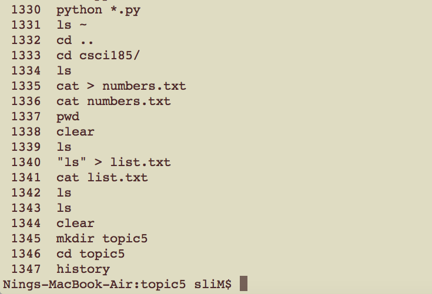
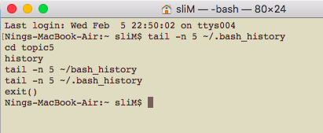
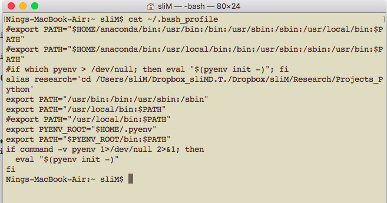
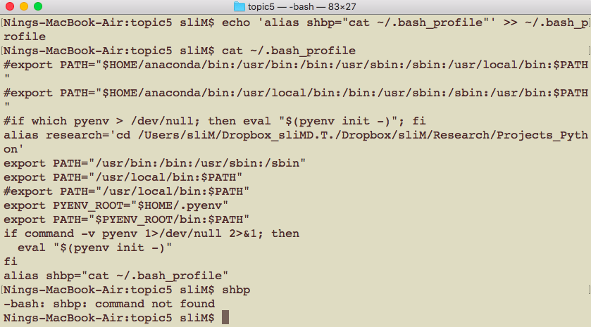
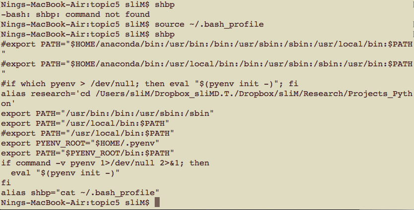
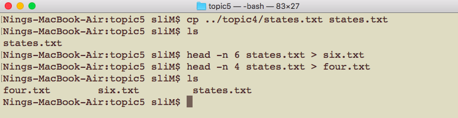
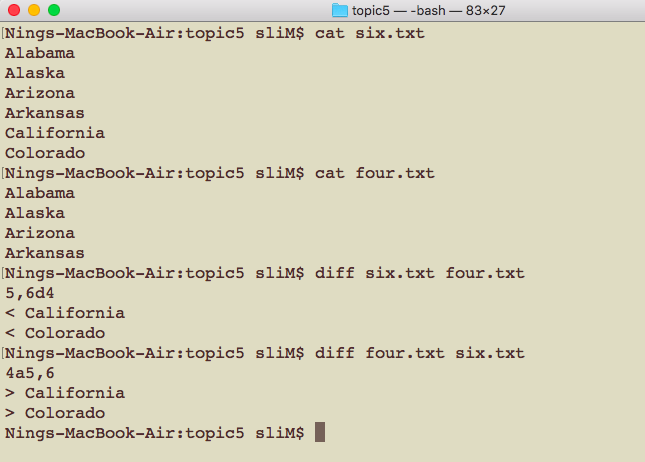
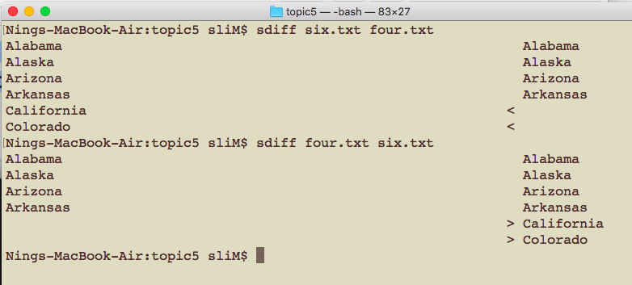
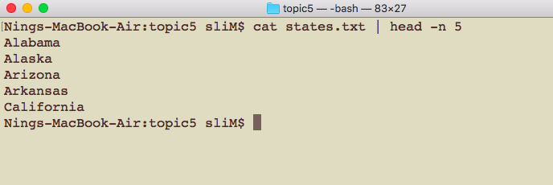
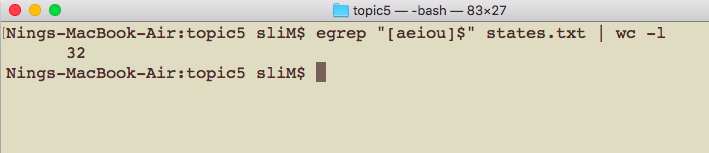

# CSCI 185 Spring 2022
# Dr. Ning Zhang
# Topic 5: Advanced Unix Tools

# History
+ Near the start of this book we discussed how you can browse the commands that you recently entered into the prompt using the **Up** and **Down** arrow keys.
+ Bash keeps track of all of your recent commands, and you can browse your command history two different ways.
+ The commands that we’ve used since opening our terminal can be accessed via the **history** command. Let’s try it out:

+ We’ve had our terminal open for a while so there are tons of commands in our history!
+ Whenever we close a terminal our recent commands are written to the **∼/.bash\_ history** file.
+ If the **∼/.bash\_ history** file does not exist, close your terminal and reopen it.

# Customizing Bash
## for mac
+ Besides ∼/.bash\_history, another text file in our home directory that we should be aware of is **∼/.bash\_profile**.
## for linux
+ Besides ∼/.bash\_history, another text file in our home directory that we should be aware of is **∼/.profile**.

## For the following examples, I will use MAC( **∼/.bash\_profile** ), replace  **∼/.bash\_profile** with **∼/.profile** if you use linux.

+ The **∼/.bash\_ profile** is a list of Unix commands that are run every time we open our terminal, usually with a different command on every line.

+ Let’s take a look at the **∼/.bash\_profile** (Your profile will be different with mine):
  - note: you can also use **vi ∼/.bash\_profile** to open and edit it. We will learn vi later.
  

## alias command
+ One of the most common commands used in **∼/.bash\_profile** is the **alias** command, which creates a shorter name for a command.
+ Let’s add **alias shbp="cat ∼/.bash\_profile"** to the end of **∼/.bash\_profile** file
  - **Warning**: use append(>>) not overwrite(>).
  - **Note**: It is better to use text editor(vi for example) to edit the **∼/.bash\_profile** file or **∼/.profile** file.
  - **Note**: We can create a copy of the **∼/.bash\_profile** file or **∼/.profile** file file (cp ∼/.bash\_profile ∼/.bash\_profile.backup or cp ∼/.profile ∼/.profile.backup).
  - **Note**: No space before or after =.
+ The alias creates a new command **shbp**.

+ In order to make the changes to our **∼/.bash\_profile** take effect we need to run **source ∼/.bash\_profile** in the console:

+ Note: We can also use alias command in the console directly, the shorter name will take effect imediatly, but will disappear when you close the terminal.

+ alias creates a command that can be used as a substitute for a longer command that we use often.
+ Setting different aliases allows you to save time if there are long commands that use often.
+ The **∼/.bash\_profile** or **∼/.profile** is a text file that is run every time we start a shell, and it’s the best place to assign aliases.

+ There are a few other details about the **∼/.bash\_profile** or **∼/.profile** that are important when you’re writing software which we’ll discuss in the Bash Programming chapter.

+ Note: In our class, we find the new commands created by alias and saved in **∼/.profile** will not work after we close and reopen the terminal. We can use **∼/.bashrc** instead of **∼/.profile**.

# Differentiate 
## diff command
+ It’s important to be able to examine **differences** between files.
+ First let’s make two simple text files in the directory.

+ If we want to look at which lines in these files are different we can use the **diff** command
+ **Only the differing lines are printed to the console.**
+ Special symbols
  - a : add
  - c : change
  - d : delete

+ 5,6d4 means **in six.txt, delete lines 5,6 to match line 4 in four.txt**
+ 4a5,6 means **in four.txt, add lines 5,6 to match line 4 in six.txt**

## sdiff command
+ We could also compare differing lines in a side-by-side comparison using sdiff:

# Pipe
+ One of the most powerful features of the command line is skilled use of the pipe (\|) which you can usually find above the backslash (\\) on your keyboard.
+ The pipe allows us to **take the output of a command**, which would normally be printed to the console, and **use it as the input to another command**.

+ It’s like fitting an actual pipe between the end of one program and connecting it to the top of another program.

+ Let’s take a look at a basic example.
  - We know the cat command takes the contents of a text file and prints it to the console.
  - This output from cat states.txt will go into our pipe, and we’ll attach the dispensing end of the pipe to head, which we use to look at the first few lines of a file.
  - Notice that this is the same result we would get from head -n 5 states.txt, we just used cat to illustrate how the pipe works.
  
  

+ The general syntax of the pipe is 

~~~~
[program that produces output] | [program uses pipe output as input instead of a file]
~~~~

+ A more common and useful example where we could use the pipe is answering the question: “How many US states end in a vowel?”

  - We could use grep/egrep and regular expressions to list all of the state names that end with a vowel, then we could use wc to count all of the matching state names:

 

# Summary
+ **history** displays what commands we’ve entered into the console since opening our current terminal.
+ The **∼/.bash\_history** file lists commands we’ve used in the past.
+ **alias** creates a command that can be used as a substitute for a longer command that we use often.
+ The **∼/.bash\_profile** or **∼/.profile** is a text file that is run every time we start a shell, and it’s the best place to assign aliases.
+ **diff** will look at which lines in two files are different.
+ **sdiff** will compare differing lines in a side-by-side comparison.
+ The **pipe (\|)** takes the output of the program on its left side and directs the output to be the input for the program on its right side.
