# CSCI 185 Spring 2022
# Dr. Ning Zhang
# Topic 6: VI/VIM, make and makefile
# Part I: VI/VIM Text Editor

+ In this topic, we will understand how the **vi Editor** works in Unix. There are many ways to edit files in Unix. Editing files using the screen-oriented text editor vi is one of the best ways. This editor enables you to edit lines in context with other lines in the file.
+ An improved version of the vi editor which is called the VIM has also been made available now. Here, VIM stands for Vi IMproved.
+ vi is generally considered the de facto standard in Unix editors because
  - It's usually available on all the flavors of Unix system.
  - Its implementations are very similar across the board.
  - It requires very few resources.
  - It is more user-friendly than other editors such as the **ed** or the **ex**.
+ We can use the vi editor to edit an existing file or to create a new file from scratch. You can also use this editor to just read a text file.

## Installation

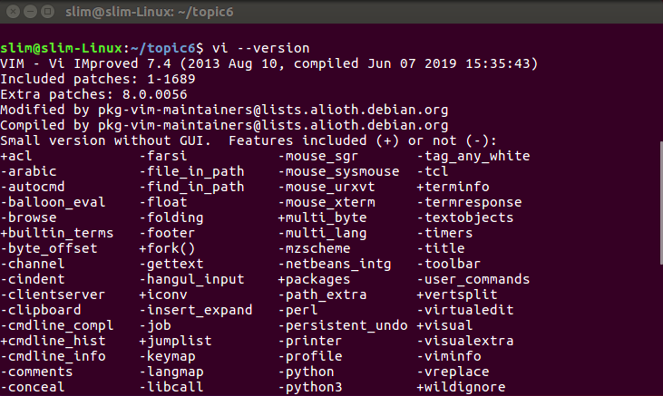

+ Linux
  - The pre-installed vi/vim is a **tiny** version(which is horrible), we need to uninstall the tiny version first
  ~~~~
  sudo apt-get remove vim.ty
  ~~~~
  - then install the full version
  ~~~~
  sudo apt install --assume-yes vim
  ~~~~

+ Mac
  - use the following command in Terminal
  
  ~~~~
  brew install vim
  ~~~~
  
  - if brew command has not been installed on your mac, use the following command

  ~~~~
  /usr/bin/ruby -e "$(curl -fsSL https://raw.githubusercontent.com/Homebrew/install/master/install)"
  ~~~~

## Starting the vi Editor
+ The following table lists out the basic commands to use the vi editor 

|Command|Description|
|---|---|
|vi filename|Creates a new file if it already does not exist, otherwise opens an existing file.|
|vi -R filename|Opens an existing file in the read-only mode.|
|view filename|Opens an existing file in the read-only mode.|

+ Following is an example to create a new file testfile if it already does not exist in the current working directory

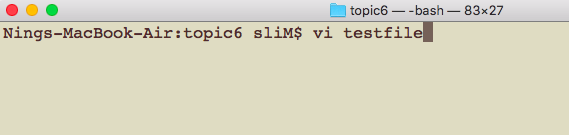

+ The above command will generate the following output

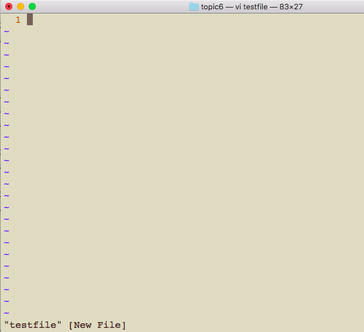

+ You will notice a tilde (~) on each line following the cursor. A tilde represents an unused line. If a line does not begin with a tilde and appears to be blank, there is a space, tab, newline, or some other non-viewable character present.
+ You now have one open file to start working on. Before proceeding further, let us understand a few important concepts.

## Operation Modes
+ While working with the vi editor, we usually come across the following two modes 
  - **Command mode** − This mode enables you to perform administrative tasks such as saving the files, executing the commands, moving the cursor, cutting (yanking) and pasting the lines or words, as well as finding and replacing. In this mode, whatever you type is interpreted as a command.
  - **Insert mode** − This mode enables you to insert text into the file. Everything that's typed in this mode is interpreted as input and placed in the file.
+ vi always starts in the command mode. To enter text, you must be in the insert mode for which simply type **i**. To come out of the insert mode, press the **Esc** key, which will take you back to the command mode.

+ **Hint** − If you are not sure which mode you are in, press the Esc key twice; this will take you to the command mode. You open a file using the vi editor. Start by typing some characters and then come to the command mode to understand the difference.

## Getting Out of vi
+ **:q** command
  - The command to quit out of vi is :q. Once in the command mode, type colon, and 'q', followed by return. 
+ **:q!** command:
  - If your file has been modified in any way, the editor will warn you of this, and not let you quit. To ignore this message, the command to quit out of vi without saving is :q!. This lets you exit vi without saving any of the changes.
  
+ **:w** command:
  - The command to save the contents of the editor is `:w`. 
+ **:wq** command:
  - You can combine the above command with the quit command, or use `:wq` and `return`.
  
  
+ **ZZ** command:
  - The easiest way to save your changes and exit vi is with the `ZZ` command. When you are in the command mode, type `ZZ`. The `ZZ` command works the same way as the `:wq` command.
+ Save as another filename:
  - If you want to specify/state any particular name for the file, you can do so by specifying it after the :w. For example, if you wanted to save the file you were working on as another filename called `filename2`, you would type `:w filename2` and return.
  
  
## Moving within a File(Part I)
+ To move around within a file without affecting your text, you must be in the command mode (press Esc twice). The following table lists out a few commands you can use to move around one character at a time

|Command|Description|
|---|---|
|k|Moves the cursor up one line|
|j|Moves the cursor down one line|
|h|Moves the cursor to the left one character position|
|l|Moves the cursor to the right one character position|

+ **Note**:
  - vi is case-sensitive. You need to pay attention to capitalization when using the commands.
  - Most commands in vi can be prefaced by the number of times you want the action to occur. For example, 2j moves the cursor two lines down the cursor location.
## Moving within a File(Part II)
+ There are many other ways to move within a file in vi. Remember that you must be in the command mode (press Esc twice). The following table lists out a few commands to move around the file

|Command|Description|
|---|---|
|0 or \||Positions the cursor at the beginning of a line|
|$|Positions the cursor at the end of a line|
|w|Positions the cursor to the next word|
|b|Positions the cursor to the previous word|
|(|Positions the cursor to the beginning of the current sentence|
|)|Positions the cursor to the beginning of the next sentence|
|E|Moves to the end of the blank delimited word|
|{|Moves a paragraph back|
|}|Moves a paragraph forward|
|\[\[|Moves a section back|
|\]\]|Moves a section forward|
|n\||Moves to the column n in the current line|
|1G or gg|Moves to the first line of the file|
|G|Moves to the last line of the file|
|nG|Moves to the nth line of the file|
|:n|Moves to the nth line of the file|
|fc|Moves forward to c, where c is a character, e.g. fa will move forward to the next character a|
|Fc|Moves back to c|
|H|Moves to the top of the screen|
|nH|Moves to the nth line from the top of the screen|
|M|Moves to the middle of the screen|
|L|Move to the bottom of the screen|
|nL|Moves to the nth line from the bottom of the screen|

## Control Commands
+ The following commands can be used with the Control Key to performs functions as given in the table below

|Command|Description|
|---|---|
|CTRL+d|Moves forward 1/2 screen|
|CTRL+f|Moves forward one full screen|
|CTRL+u|Moves backward 1/2 screen|
|CTRL+b|Moves backward one full screen|
|CTRL+e|Moves the screen up one line|
|CTRL+y|Moves the screen down one line|
|CTRL+u|Moves the screen up 1/2 page|
|CTRL+d|Moves the screen down 1/2 page|
|CTRL+b|Moves the screen up one page|
|CTRL+f|Moves the screen down one page|
|CTRL+I|Redraws the screen|

## Editing Files

To edit the file, you need to be in the insert mode. There are many ways to enter the insert mode from the command mode

|Command|Description|
|---|---|
|i|Inserts text before the current cursor location|
|I|Inserts text at the beginning of the current line|
|a|Inserts text after the current cursor location|
|A|Inserts text at the end of the current line|
|o|Creates a new line for text entry below the cursor location|
|O|Creates a new line for text entry above the cursor location|

## Deleting Characters
+ Here is a list of important commands, which can be used to delete characters and lines in an open file

|Command|Description|
|---|---|
|x|Deletes the character under the cursor location|
|X|Deletes the character before the cursor location|
|dw|Deletes from the current cursor location to the next word|
|d^|Deletes from the current cursor position to the beginning of the line|
|d$|Deletes from the current cursor position to the end of the line|
|D|Deletes from the cursor position to the end of the current line|
|dd|Deletes the line the cursor is on|

+ As mentioned above, most commands in vi can be prefaced by the number of times you want the action to occur. For example, 2x deletes two characters under the cursor location and 2dd deletes two lines the cursor is on.
+ It is recommended that the commands are practiced before we proceed further.

## Change Commands
+ You also have the capability to change characters, words, or lines in vi without deleting them. Here are the relevant commands

|Command|Description|
|---|---|
|cc|Removes the contents of the line, leaving you in insert mode.|
|cw|Changes the word the cursor is on from the cursor to the lowercase **w** end of the word.|
|r|Replaces the character under the cursor. vi returns to the command mode after the replacement is entered.|
|R|Overwrites multiple characters beginning with the character currently under the cursor. You must use Esc to stop the overwriting.|
|s|Replaces the current character with the character you type. Afterward, you are left in the insert mode.|
|S|Deletes the line the cursor is on and replaces it with the new text. After the new text is entered, vi remains in the insert mode.|

## Copy and Paste Commands
+ You can copy lines or words from one place and then you can paste them at another place using the following commands

|Command|Description|
|---|---|
|yy|Copies the current line.|
|yw|Copies the current word from the character the lowercase w cursor is on, until the end of the word.|
|p|Puts the copied text after the cursor.|
|P|Puts the yanked text before the cursor.|

## Advanced Commands
+ There are some advanced commands that simplify day-to-day editing and allow for more efficient use of vi

|Command|Description|
|---|---|
|J|Joins the current line with the next one. A count of j commands join many lines.|
|<<|Shifts the current line to the left by one shift width.|
|>>|Shifts the current line to the right by one shift width.|
|~|Switches the case of the character under the cursor.|
|^G|Press Ctrl and G keys at the same time to show the current filename and the status.|
|U|Restores the current line to the state it was in before the cursor entered the line.|
|u|This helps undo the last change that was done in the file. Typing 'u' again will re-do the change.|
|J|Joins the current line with the next one. A count joins that many lines.|
|:f|Displays the current position in the file in % and the file name, the total number of file.|
|:f filename|Renames the current file to filename.|
|:w filename|Writes to file filename.|
|:e filename|Opens another file with filename.|
|:cd dirname|Changes the current working directory to dirname.|
|:e #|Toggles between two open files.|
|:n|In case you open multiple files using vi, use :n to go to the next file in the series.|
|:p|In case you open multiple files using vi, use :p to go to the previous file in the series.|
|:N|In case you open multiple files using vi, use :N to go to the previous file in the series.|
|:r file|Reads file and inserts it after the current line.|
|:nr file|Reads file and inserts it after the line n.|

## Word and Character Searching
+ The vi editor has two kinds of searches: string and character. For a string search, the / and ? commands are used. When you start these commands, the command just typed will be shown on the last line of the screen, where you type the particular string to look for.
+ These two commands differ only in the direction where the search takes place
  - The / command searches forwards (downwards) in the file.
  - The ? command searches backwards (upwards) in the file.
+ The **n** and **N** commands repeat the previous search command in the same or the opposite direction, respectively. Some characters have special meanings. These characters must be preceded by a backslash (\\) to be included as part of the search expression.

|Command|Description|
|---|---|
|^|Searches at the beginning of the line (Use at the beginning of a search expression).|
|.|Matches a single character.|
|\*|Matches zero or more of the previous character.|
|$|End of the line (Use at the end of the search expression).|
|\[|Starts a set of matching or non-matching expressions.|
|<|This is put in an expression escaped with the backslash to find the ending or the beginning of a word.|
|>|This helps see the '<' character description above.|

+ The character search searches within one line to find a character entered after the command. The **f** and **F** commands search for a character on the current line only. **f** searches forwards and **F** searches backwards and the cursor moves to the position of the found character.
+ The **t** and **T** commands search for a character on the current line only, but for **t**, the cursor moves to the position before the character, and **T** searches the line backwards to the position after the character.

## Set Commands
+ You can change the look and feel of your vi screen using the following **:set** commands. Once you are in the command mode, type **:set** followed by any of the following commands.

|Command|Description|
|---|---|
|:set ic|Ignores the case when searching|
|:set ai|Sets autoindent|
|:set noai|Unsets autoindent|
|:set nu|Displays lines with line numbers on the left side|
|:set sw|Sets the width of a software tabstop. For example, you would set a shift width of 4 with this command — :set sw = 4|
|:set ws|If wrapscan is set, and the word is not found at the bottom of the file, it will try searching for it at the beginning|
|:set wm|If this option has a value greater than zero, the editor will automatically "word wrap". For example, to set the wrap margin to two characters, you would type this: :set wm = 2|
|:set ro|Changes file type to "read only"|
|:set term|Prints terminal type|
|:set bf|Discards control characters from input|

+ Note
  - `set nonu` will turn off the line number display.
  - `set nu!` to toggle off display of line numbers.

## Running Commands
+ The vi has the capability to run commands from within the editor. To run a command, you only need to go to the command mode and type `:! command`.

+ For example, if you want to check whether a file exists before you try to save your file with that filename, you can type `:! ls` and you will see the output of ls on the screen.

+ You can press any key (or the command's escape sequence) to return to your vi session

## Replacing Text
+ The substitution command (:s/) enables you to quickly replace words or groups of words within your files. Following is the syntax to replace text 

~~~~
:s/search/replace/g
~~~~

+ The **g** stands for globally. The result of this command is that all occurrences on the cursor's line are changed.

+ For example, to search for the first occurrence of the string ‘foo’ in the current line and replace it with ‘bar’, you would use 
~~~~
:s/foo/bar/.
~~~~
+ To replace all occurrences of the search pattern in the current line, add the `g` flag. 
~~~~
:s/foo/bar/g
~~~~

## Important Points to Note
+ The following points will add to your success with vi −

  - You must be in command mode to use the commands. (Press Esc twice at any time to ensure that you are in command mode.)

  - You must be careful with the commands. These are case-sensitive.

  - You must be in insert mode to enter text.

# [Reference](https://www.tutorialspoint.com/unix/unix-vi-editor.htm)

# [Lab](http://www.vimlabs.world/landing.html/)

# Part II: make and makefile

# makefile
+ Once upon a time there were no web browsers, file browsers, start menus, or search bars. When somebody booted up a computer all they got a was a **shell prompt**, and all of the work they did started from that prompt.
+ Back then people still loved to share software, but there was always the problem of how software should be installed. The **make** program is the best attempt at solving this problem, and make’s elegance has carried it so far that it is still in wide use today.
+ The guiding design goal of make is that in order to install some new piece of software one would:
  - Download all of the files required for installation into a directory.
  - cd into that directory.
  - **Run make.**
+ This is accomplished by specifying a file called **makefile**, which describes the relationships between different files and programs.

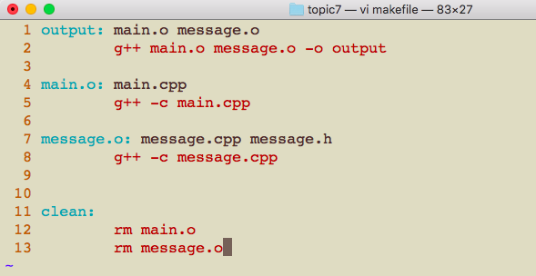

+ In addition to installing programs, **make** is also useful for creating documents automatically.
+ Let’s build up a makefile that creates a readme.txt file which is automatically populated with some information about our current directory.
+ Let’s start by creating a very basic makefile with vi:

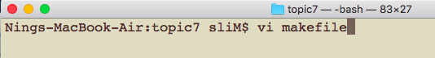

+ Please type the following two lines to the makefile in the vi mode.

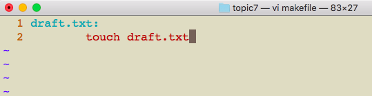

+ The simple makefile above shows illustrates a rule which has the following general format:

~~~~
[target]: [Dependencies...]
[tab][Commands...]
~~~~

+ In the simple example we created draft.txt as the **target**, a file which is created as the result of the **command(s)**.
+ It’s very important to note that any commands under a target must be indented with a **Tab**.
+ **If we don’t use Tabs to indent the commands then make will fail.**

+ Let’s save and close the makefile, then we can run ls command in the console:

+ Let’s use the **make** command with the **target** we want to be “made” as the only argument:
  - The commands that are indented under our definition of the rule for the draft.txt target were executed, so now draft.txt exists!
  

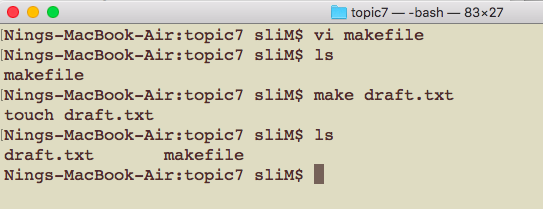

+ Let’s try running the same make command again.
+ Since the target file already exists no action is taken, and instead we’re informed that the rule for draft.txt is “up to date” (there’s nothing to be done).

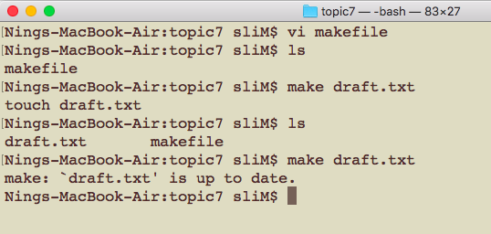

+ If we look at the general rule format we previously sketched out, we can see that we didn’t specify any dependencies for this rule.
+ A **dependency** is a file that the target depends on in order to be built.
+ If a dependency has been updated since the last time make was run for a target then the target is not “up to date.” This means that the commands for that target will be run the next time make is run for that target.
+ This way, the changes to the dependency are incorperated into the target.
+ **The commands are only run when the dependencies change, or when the target doesn’t exist at all, in order to avoid running commands unnecessarily.**

+ Now let’s update our makefile with vi to automatically generate a readme.txt.

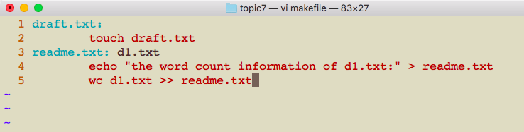

+ A new file d1.txt is needed, which will be the dependency of readme.txt

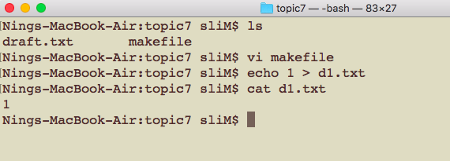

+ Now let’s run make with readme.txt as the target:

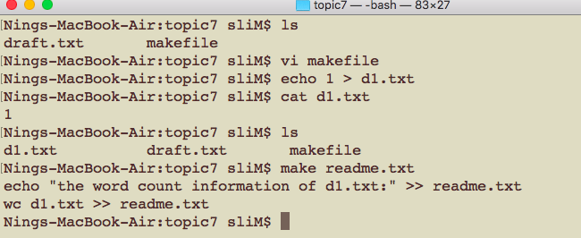

+ What do you think will happen if we run make readme.txt again?
  - Nothing happened! Since the readme.txt file still exists and no changes were made to any of the dependencies for readme.txt (toc.txt is the only dependency) make doesn’t run the commands for the readme.txt rule.
 
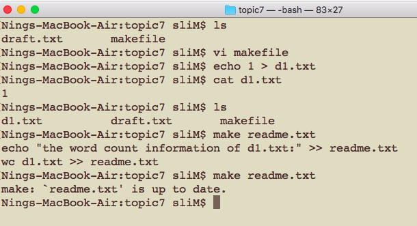

+ Now let’s modify d1.txt then we’ll try running make again.

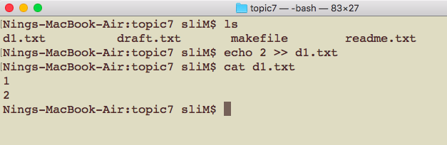

+ It looks like make successfully updated readme.txt! With every change to d1.txt, running make readme.txt will programmatically update readme.txt.

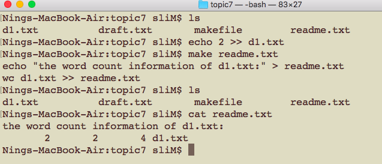

## makefile all

+ In order to simplify the make experience, we can create a rule at the top of our makefile called **all** where we can list all of the files that are built by the makefile.

+ By adding the all target we can simply run make without any arguments in order to build all of the targets in the makefile.
+ Let’s use vi to add this rule:

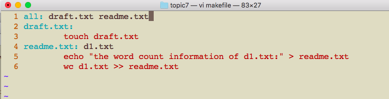

+ We can also add another special rule at the end of the makefile called **clean** which destroys the files created by our makefile:

 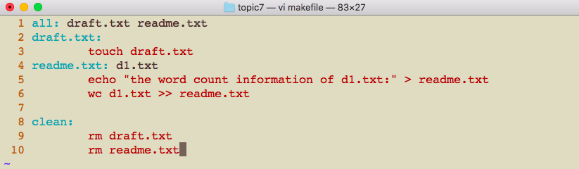
 
 + Let’s save and close our makefile then let’s test it out first let’s clean up our repository and then make:
 
 
 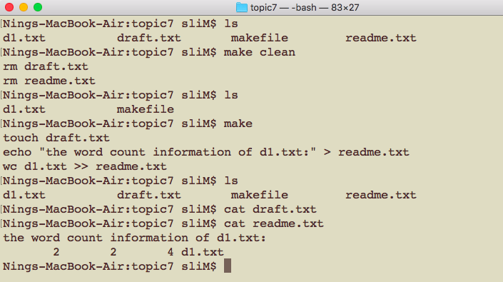
 
 
 
  # Practice
  + Edit makefile to
    - 1. create a target
    - 2. copy states.txt from another folder(topic4 for example)
    - 3. save all the state names that begin and end with a vowel.
    - 4. save the word count information of the state names you got in step 3.
    - 5. clean/rm states.txt
  
  + Note: In Shell Script, one dollar sign ($) is used to represent a variable(we will learn this in the next topic), so we use two dollar signs ($$) to represent **end of the string** for egrep command. 

