# CSCI185 Spring 2021
# Dr. Ning Zhang
# Topic 7: Bash Programming - Basics

# Bash Programming
+ With the thousands of commands available for the command line user, how can you remember them all?
+ The answer is, you don’t. The real power of the computer is its ability to do the work for you.
+ To get it to do that,we use the power of the shell to automate things. We write **shell scripts**.
+ In the simplest terms, a shell script is a file containing a series of commands.
+ The shell reads this file and carries out the commands as though they have been entered directly on the command line.
+ Now, we are going to dive into doing a little computer programming with the Bash programming language.
+ We’ll start off by writing simple shell scripts based on a few examples.
+ The Bash programming language can do very basic arithmetic, which we’ll demonstrate in this section.
+ Let’s use vi text editor to create a file math.sh and type the following into your text editor:
  - Note: There are spaces between the + operator and the oprerands.

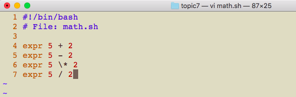

+ Save math.sh and then run this script in your shell with **Bash**:

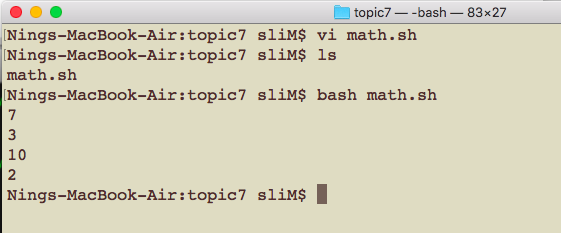

# Math
+ Let’s break down what’s going on in the Bash script you just created.
+ **Bash executes programs in order from the first line in your file to the last line**.
+ The first line of the script begins with a **pound sign** (**#**). This is a special clue, called a shebang, given to the shell indicating what program is used to interpret the script. In this case, it is **bash**. Other scripting languages such as Perl and python also use this mechanism.
  - You can use **which bash** command to find the location of bash, different Operating Systems may have different locations for bash.
  - When shebang exists, we can run the script by **./math.sh**. Note you need to change the permission by chmod command if there is the warning: **Permission denied**. (chmod 744 math.sh)
  
  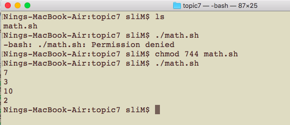
  
+ The second line is a **comment**. Anything written after a **pound sign** (**#**) is a comment and is not executed by Bash.
+ The **expr** command can be used to evaluate Bash expressions.
+ An **expression** is just a valid string of Bash code that, when run, produces a result.

+ The arithmetic operators that you’re already familiar with for addition (+), subtraction (-), and multiplication (\*) work like you would expect them to.
+ Notice that **when doing multiplication you need to escape the star character**, otherwise Bash thinks you’re trying to create a regular expression!
+ The division operator (/) does not work as you might expect it to since 5 / 2 = 2.5. **Bash does integer division**, which means that the result of dividing one number by another is always rounded down to the nearest integer.
+ If you want to do more complex math, for example math with fractions and numbers with decimals.
+ Then I highly suggest combining echo and the **b**ench **c**alculator program called **bc**.

+ Open up a new file called bigmath.sh and type in the following:(Note: the () is not necessary in the third expression)

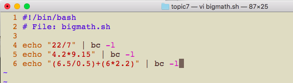

+ Save bigmath.sh and then run this script in your shell:

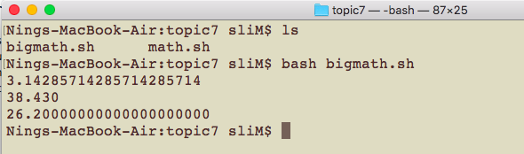

+ In Bash you can **store data in variables**.
+ You can create your own variables. Make sure you follow these rules when you’re naming variables:
  - Every character should be **lowercase**.
  - The variable name should **start with a letter**.
  - The name should **only contain alphanumeric characters and underscores(_)**.
  - Words in the name should be separated by underscores.
+ If you follow those rules then you can avoid accidentally overwriting data stored in environmental variables.
+ You can **assign data to a variable using the equals sign (=)**.
+ The data you store in a variable can either be a string or a number.
+ Let’s create a variable now on the command line(Note: no spaces):

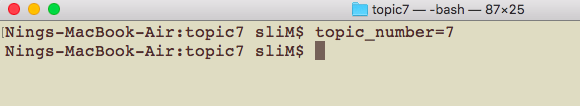

+ The variable name is on the left hand side of the equals sign, and the data which will be stored in that variable is on the right hand side of the equals sign.
+ Notice that there are no spaces on either side of the equals sign, this is not allowed when assigning variables:

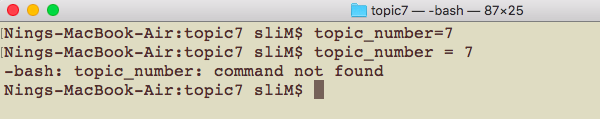

+ In order to print the data in a variable, also called the value of a variable, we can use **echo**.

+ When you want to **retrieve the value of a variable** you must use the **dollar sign ($)** before the name of the variable. Let’s try this out:

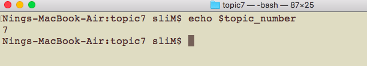

+ You can modify the value of a variable using arithmetic operators by using the **let command**(Take a look at the command result by command with no let):

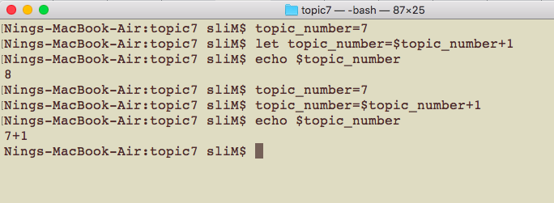

+ You can also store strings in variables:

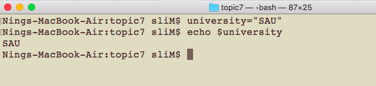

+ Now, let's do it in a script.

~~~~
#!/bin/bash
# File: demo1.sh
#define variables
num1=5
num2=10
# use variables
echo $num1
echo $num1+$num2
# use the existing variable(s) to define a new variable
num3=$num2+1
echo $num3
~~~~

~~~~
#!/bin/bash
# File: demo2.sh
#define variables
str1="Hello"
str2="World"
# use variables
echo "$str1 $str2"
~~~~

+ Occasionally you might want to run a command and store the result of that command in a variable.
+ We can do this by wrapping the command in a **dollar sign and parentheses** (**$( )**) around a command.
+ This syntax is called **command substitution**. The command is executed and then gets replaced by the string that resulted from running the command.
+ For example if we wanted to store the number of lines in math.sh:

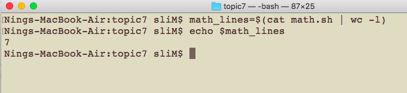

+ **Variable names with a dollar sign can also be used inside other strings** in order to insert the value of the variable into the string:

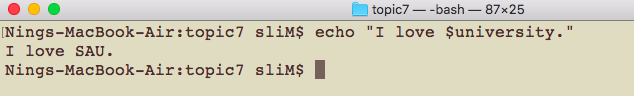

# User Input
+ If you’re making Bash programs for you or for others to use one way you can get user input.
+ You can ask users to type in a string on the command line by temporarily stopping the execution of your program using the read command.
+ Let’s write a small script where you can see how the read command works:

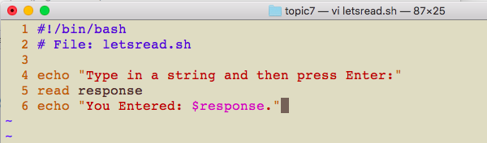

+ Now let’s run this script:

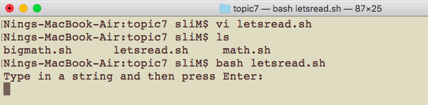

+ Let’s type Hello! into the console, then press enter:

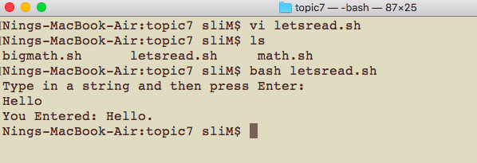

+ The read command prompts the user to type in a string, and the string that the user provides is stored in the variable that is given to the read command in the script.

#  Summary
+ You can do simple arithmetic with the **expr** command using Bash programming language.
+ Perform more complicated arithmetic by piping a string expression into **bc** using **echo**.
+ **Variables** can be assigned with the equal sign (=) operator.
+ The value of a variable can be accessed with the **dollar sign** (**$**) before the variable name.
+ You can use the dollar sign and parentheses syntax (**command substitution**) to execute a command and save the output in a variable.
+ **read** command stores a string that the user provides in a variable.
