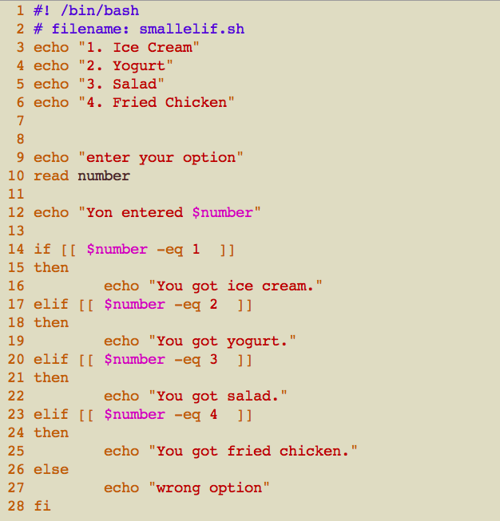
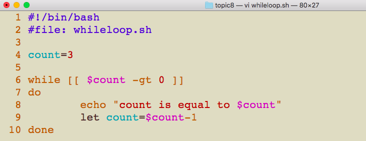

# CSCI185 Spring 2021
# Dr. Ning Zhang
# Topic 8: Bash Programming -  Logic, If/Else, For loop and While loop

# Logic

+ When writing computer programs it is often useful in your program to **make decisions** based on inputs or some results.
+ Bash provides mechanisms for creating **logical expressions** which resemble mathematical equations.
+ These logical expressions can be evaluated until they are either **true** or **false**.
+ In fact, true and false are both simple Bash commands!

+ Let’s try them both out now:

+ At first it doesn’t look like they do much. In order to see how they work, we’re going to need to look under the hood of Unix a little bit.
+ Whenever you execute a program on the command line, in general one of two things will happen:
  - either **the command is executed successfully**, or 
  - **there’s an error**.
+ In terms of **errors** there are many ways that a program can go wrong, and Unix can take different actions depending on what kind of error occurs.
+ For example if **I enter the name of a command that does not exist, then I’ll see an error.**
  - Since this command does not exist, it creates a specific kind of error which is indicated by the program’s **exit status**.
 

+ The **exit status of a program is an integer**, the exit status of the last program run is stored in the question mark variable **$?**.

+ This particular **exit status 127** made an indication to the shell that it should print an error message to the console.

+ What’s the exit status of a program that runs successfully?

+ So the exit status of a successful program is 0.

+ Now let’s take a look at the exit statuses of **true** and **false**:

+ As you can see true has an exit status of 0 and false has an exit status of 1.

+ [More about bash exit code](https://www.cyberciti.biz/faq/linux-bash-exit-status-set-exit-statusin-bash/).

+ Knowing the exit status of **true** and **false** is important when discussing the logical operators: 
  - the **AND** operator (&&) 
  - the **OR** operator (||).
  - the **NOT** operator (!)
+ The **AND**, **OR** and **NOT** operators can be used for conditional execution of programs on the command line.

## AND
+ In the case of the **AND** operator, **the program on the right hand side of && will only be executed if the program on the left hand side of && has an exit status of 0**.

|condition1/command1|condition2/command2|condition1/command1 && condition2/command2|
|----|----|----|
|true(0)|true(0)|true(0)|
|true(0)|false(1)|false(1)|
|false(1)|true(0)|false(1)|
|false(1)|false(1)|false(1)|

+ Since false has an exit status of 1, the program echo “Hello World” is not executed, so nothing is printed to the console for that command.

## OR 
+ The OR operator || follows a similar set of principles.
+ Commands on the right hand side of || are only executed if the command on the left hand side fails and therefore has an exit status 1.

|condition1/command1|condition2/command2|condition1/command1 \|\| condition2/command2|
|----|----|----|
|true(0)|true(0)|true(0)|
|true(0)|false(1)|true(0)|
|false(1)|true(0)|true(0)|
|false(1)|false(1)|false(1)|

## NOT

|condition/command| ! condition/command|
|---|---|
|true(0)|false(1)|
|false(1)|true(0)|

+ **By combining AND and OR operators you can precisely control the conditions for when certain commands should be executed.**

## Summary
+ **true** command has exit status 0.
+ **false** command has exit status 1.
+ **AND** operator

|condition1/command1|condition2/command2|condition1/command1 && condition2/command2|
|----|----|----|
|true(0)|true(0)|true(0)|
|true(0)|false(1)|false(1)|
|false(1)|true(0)|false(1)|
|false(1)|false(1)|false(1)|

+ **OR** operator

|condition1/command1|condition2/command2|condition1/command1 \|\| condition2/command2|
|----|----|----|
|true(0)|true(0)|true(0)|
|true(0)|false(1)|true(0)|
|false(1)|true(0)|true(0)|
|false(1)|false(1)|false(1)|

+ NOT operator

|condition/command| ! condition/command|
|---|---|
|true(0)|false(1)|
|false(1)|true(0)|

# Conditional expressions
+ Enabling your Bash script to make decisions is extremely useful. We can achieve this by using conditional expressions with logical statements.
+ Conditional expressions are always between double brackets \[\[ \]\], and they either use **logical flags** or **logical operators**.
## Logical flags
+ For example, there are several logical flags you could use for **comparing two integers**.
+ If we wanted to see if one integer was **greater than** another we could use **-gt**, the greater than flag.
+ Here is one example. Note the**space(s)** between double brackets and the numbers.

+ In the example above, the exit code of \[\[  4 -gt 3  \]\] is 0, which represents true, the exit code of \[\[  4 -gt 5  \]\] is 1, which represents false. The results are logically consistent.
+ To quickly test the logical value of a conditional expression, we can use the AND and OR operators so that an expression will print “t” if it’s true and “f” if its false:

+ There are several other varieties of logical flags, and you can find a table of several of these flags below:

|Logical Flag|Meaning|Usage|
|----|----|----|
|-gt|Greater Than|\[\[  $planets -gt 8 \]\]|
|-ge|Greater Than or Equal to |\[\[  $votes -ge 270 \]\]|
|-eq|Equal|\[\[ $fingers -eq 10 \]\]|
|-ne|Not Equal|\[\[ $pages -ne 0 \]\]|
|-le|Less Than or Equal to|\[\[ $candles -lt 10 \]\]|
|-lt|Less Than|\[\[ $a -lt 2 \]\]|
|-e|A File Exists|\[\[ -e $taxes_2016 \]\]|
|-d|A Directory Exists|\[\[ -d $photos \]\]|
|-z|Length of a String is 0|\[\[ -z $name \]\]|
|-n|Length of a String is NOT 0|\[\[ -n $name \]\]|

+ try the examples below
~~~~
[[ -e math.sh ]] && echo t || echo f

file_name="math.sh"
[[ -e $file_name ]] && echo t || echo f

~~~~

## Logical operators
+ In addition to logical flags there are also logical operators.
+ One of the most useful logical operators is the **regex match operator =∼**.
+ The regex match operator compares a string to a regular expression and if the string is a match for the regex then the expression is equivalent to true, otherwise it’s equivalent to false.

+ Here’s a table of some of the useful logical operators in case you need to reference how they’re used later:

|Logical Operator|Meaning|Usage|
|---|---|---|
|=~|Matches Regular Expression|\[\[ $consonants =~ [aeiou] \]\]|
|=|String Equal to|\[\[ $password = "123456" \]\]|
|!=|String Not Equal to|\[\[ $password != "123456" \]\]|
|!|Not|\[\[ !"apple"=~^b \]\]|

## if-elif-else statement
+ Syntax
~~~~
if condition1
then
    # code inside of if statement
elif condition2
then
    # code inside of elif statement
elif condition3
then
    # code inside of elif statement
    ....
else
    # code inside of else statement
fi
~~~~

+ Conditional expressions are powerful because you can use them to control how a Bash program that you’re writing is executed.
+ One of the fundamental constructs in Bash programming is the **IF statement**.
+ **Code written inside of an IF statement is only executed if a certain condition is true, otherwise the code is skipped**.
+ Let’s write a small program with an IF statement:

+ First this program will print “Start program”, and ask the user to enter a number from the keyboard.
+ Then the IF statement will check if the conditional expression \[\[ $number -eq 4 \]\] is true.
+ It will only be true if you entered 4. If the conditional expression is true then it will execute the code in between then and fi, otherwise it will skip over that code
+ Finally the program will print “End program.”

+ You can pair **IF** statements with **ELSE** statements.
+ An ELSE statement only runs if the conditional expression being evaluated by the IF statement is false.

+ Between IF and ELSE statements you can also have ELIF statements.
+ These statements act like IF statements except they’re only evaluated if preceding IF and ELIF statements have all evaluated false conditional expressions.
+ Let’s create a brief program using ELIF:

+ You should also know that you can combine conditional execution, conditional expressions, and IF/ELIF/ELSE statements.

## Summary

+ Conditional expressions are always in double brackets \[\[ \]\]. They have exit an exit status of 0 if they contain a true assertion or 1 if they contain a false assertion.
+ IF statements evaluate conditional expressions. If an expression is true then the code within an IF statement is executed, otherwise it is skipped.
+ ELIF and ELSE statements also help control the flow of a Bash program

# For and While loops

+ **Loops** are one of the most important programming structures in the Bash language.
+ All of the programs we’ve written so far are executed from the first line of the script until the last line, but **loops allow you to repeat lines of code** based on logical conditions or by following a sequence.

## For loop
+ The first kind of loop that we’ll discuss is a FOR loop.
+ FOR loops iterate through every element of a sequence that you specify.

### For loop with brace expansion:
+ Let’s take a look at a small example FOR loop:

+ Bash has a very handy tool for creating strings out of sequences called **brace expansion**.
+ Brace expansion uses the **curly brackets** and **two periods { .. }** to create a sequence of letters or numbers.
+ Now let’s execute this script:

+ Let’s walk through forloop.sh line-by-line.
  - First “Before Loop” is printed before the FOR loop, then the loop begins.
  - FOR loops **start with the syntax for [variable name] in [sequence] followed by do** on the next line.
  - The **variable name** that you define immediately after for will take on a value inside of the loop that corresponds to an element in the **sequence** you provide after in, **starting with the first element of the sequence, followed by every subsequent element**.
  - Valid sequences include **brace expansions, explicit lists of strings, arrays**, and **command substitutions**.
    + In this instance we’re using the brace expansion {1..3} which we know expands to the string “1 2 3”.
  - The **code executed in each iteration of the loop is written between do and done**.
  - In the first iteration of the loop, the variable $i contains the value 1. The string “i is equal to 1” is printed to the console.
  - There are more elements in the brace expansion after 1, so **after reaching done the first time, the program starts executing back at the do statement**.

### For loop with explicit list:

### For loop with array:

  - Arrays in Bash are ordered lists of values.
  - Arrays are created with parentheses ( ) with a space separating each element in the list.
  - To retrieve the array you need to use parameter expansion, which involves the dollar sign and curly brackets ${ }.
  - The positions of the elements in the array are numbered starting from zero.
  - To get all of the elements of plagues use a star * between the square brackets.
  
### For loop with command substitution:

## While loop
+ Now that we’ve gotten a few FOR loops working let’s move on to WHILE loops.
+ Let’s take a look at an example WHILE loop:

  - The WHILE loop begins first with the while keyword followed by a conditional expression.
  - As long as the conditional expression is equivalent to true when an iteration of the loop begins, then the code within the WHILE loop will continue to be executed
  - Before the WHILE the count variable is set to be 3, but then each time the WHILE loop is executed 1 is subtracted from the value of count.
  - The loop then starts from the top again and the conditional expression is re-checked to see if it’s still equivalent to true.
  - After three iterations through the loop count is equal to 0 since 1 is subtracted from count in every iteration.
  - Therefore the logical expression \[\[ $count -gt 0 \]\] is no longer equal to true and the loop ends.

+ Another exmaple(you may need it for the homework)

+ A different way for the previous question.

# More about Loops 
+ Topics not on the textbook.

## The C-style Bash for loop
+ The syntax of the C-style for loop is taking the following form:
  - The **INITIALIZATION** part is executed only once when the loop starts.
  - Then, the **TEST** part is evaluated.
    + If it is true, commands inside the body of the for loop are executed, and the **STEP** part is updated.
    + If it is false, the loop is terminated.
    
~~~
for ((INITIALIZATION; TEST; STEP))
do
  [COMMANDS]
done
~~~

+ Example: In the following example code, the loop stars by initializing i = 0, and before each iteration checks if i ≤ 10. If true it prints the current value of i and increments the variable i by 1 (i++) otherwise the loop terminates.

## break and continue Statements
+ The break and continue statements can be used to control the loop execution.

### break Statement

+ The break statement terminates the current loop and passes program control to the statement that follows the terminated statement. It is usually used to terminate the loop when a certain condition is met.

+ Example 1: In the following example, we are using the if statement to terminate the execution of the loop once the current iterated item is equal to **3**.

+ Example 2: In the following example, we are using the if statement to terminate the execution of the loop once the current iterated item is equal to **3** in a function(we learn function in Topic 9).

+ Example 3: We can also use break in a while loop.

### continue Statement

+ The continue statement exits the current iteration of a loop and passes program control to the next iteration of the loop.
+ Example 1: Compare it with the first example in break statement

+ Example 2: 

## Summary
+ **FOR loops** iterate through a sequence so that a variable that you assign takes on the value of every element of the sequence in every iteration of the loop.
+ **WHILE loops** check a conditional statement at the beginning of every iteration.
