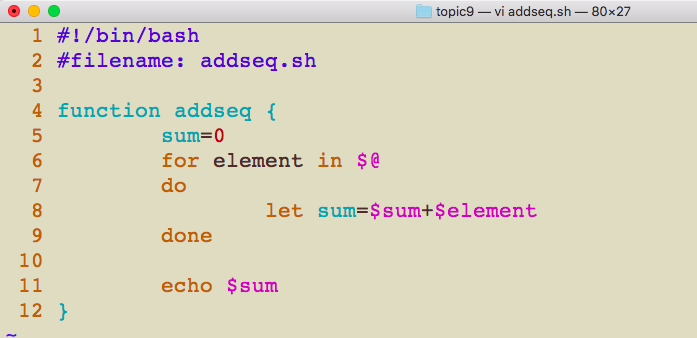
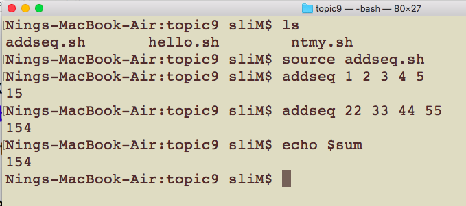

# CSCI 185 Spring 2021
# Dr. Ning Zhang
# Topic 9: Functions
+ [Do not reinvent the wheel](https://en.wikipedia.org/wiki/Reinventing_the_wheel)
  - [source code of commands](http://git.savannah.gnu.org/cgit/coreutils.git/tree/src/)
+ A **function** is a small piece of code that has a name.
+ Writing functions allows us to **re-use** the same code multiple times across programs.

## Basic syntax

+ Functions have the the following syntax(Note the space between [name of function] and { ):
~~~~
function [name of function] {
  # code here
}
~~~~
+ Let’s open up a new file called hello.sh so we can write our first simple function.

+ The entire structure of the function including 3 components that serve as the **function definition**.
  - the **function keyword**, 
  - the **name of the function**, 
  - the **code** for the function written **inside of the brackets**.
+ **After a function is defined it can be used like any other command.**
+ Using our hello command three times should be the equivalent of using echo “Hello” three times. Let’s run this script to find out:

## Function Arguments

+ Functions share lots of their behavior with individual bash scripts including how they handle arguments.
+ The usual bash script arguments like $1, $2, and $@ all work within a function, which allows you to specify function arguments.
  - The first argument to your script is stored in $1
  - the second argument is stored in $2,
  - etc, etc.
  - An array of all of the arguments passed to your script is stored in $@.
  
+  Let’s create a slightly modified version of hello.sh, which we’ll call ntmy.sh using the argument $1:

+ In the bash script ntmy.sh, we’re not using the ntmy function after we’ve defined it.
+ That’s because we’re going to start using the functions that we define as **command line programs**.
+ We’re going to start using the **source** command, which allows us to use function definitions in bash scripts as command line commands.
+ Let’s use source with this file so that we can then use the ntmy command:

+ And just like that you’ve created your very own command!
  - Note: **Once you close your current shell you’ll lose access to the ntmy command.** But in the next section we’ll discuss how to set up your own commands so that you always have access to them.
  
+ Let’s write a more complicated function.
+ Imagine that we wanted to add up a sequence of numbers from the command line, but we had no way of knowing how many numbers would be in the sequence.
+ These requirements can be satisfied by using the **$@** variable.
+ Let’s write this program in a file called **addseq.sh**.

+ In the program above we initialize the sum variable to be 0 so that we can add other values in the sequence to sum.
+ We then use a FOR loop to iterate through every element of $@, which is an array of all the arguments we provide to addseq.
+ Finally we echo the value of sum. Let’s source this program and test it out:

+ If we look back at the code for addseq.sh we can see that we created a variable in the function called **sum**.
+ When you create variables in functions those variables become **globally accessible**, meaning that even after the program is finished that variable retains its value in your shell.
+ We can easily verify this by echoing the value of sum:

+ This is an example of one strategy we can use to **retrieve values** that a function has calculated.
+ Unfortunately this approach is **problematic** because it changes the values of variables that we might be using in our shell.
+ For example if we were storing some other important value in a variable called sum we would **destroy** that value by accident by running addseq.
+ In order to avoid this problem it’s important that we use the **local** keyword when assigning variables within a function.
+ The **local** keyword ensures that variables outside of our function **are not overwritten** by our function.
+ Let’s create a new version of addseq called addseq2 which uses local when assigning variables.

+ Now let’s source both files so we demonstrate how local helps us avoid overwriting variables.
+ Without local keyword, our original addseq overwrites the value we assigned to sum.

+ By using local within our function the value of sum is preserved!

+ In order to correctly capture the value of the result of addseq2 we can use command substitution.

# Return value

+ Unlike functions in “real” programming languages, Bash functions don’t allow you to return a value when called.
+ When a bash function completes, its return value is the status of the last statement executed in the function, 0 for success and non-zero decimal number in the 1 - 255 range for failure.
+ The return status can be specified by using the return keyword, and it is assigned to the variable $?. The return statement terminates the function. You can think of it as the function’s exit status.

+ A better option to return a value from a function is to send the value to stdout using **echo** or printf

 
# Summary
+ Functions start with the function keyword followed by the name of the function and curly brackets {}.
+ You can use variables like $1,$2, and $@ in order to provide arguments to functions, just like a Bash script.
+ Use the source command in order to read in a Bash script with function definitions so that you can use your functions in your shell.
+ Use the local keyword to prevent your function from creating or modifying global variables
+ Be sure to echo the results of your function (if there are any) so that they can be captured with command substitution.

